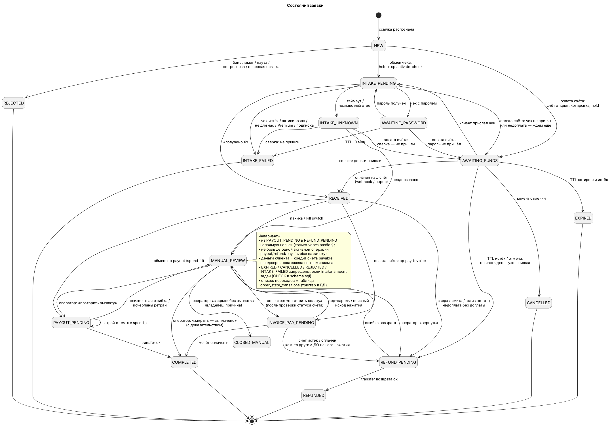
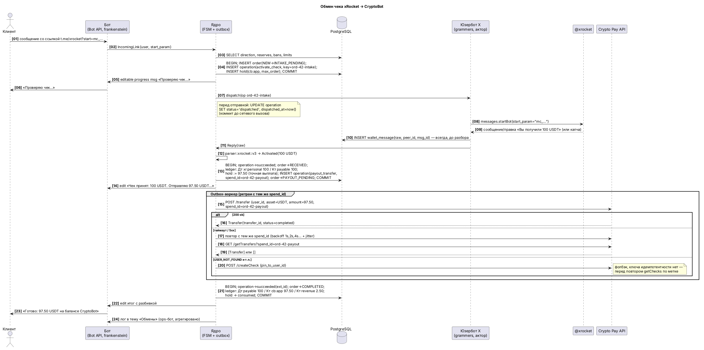

# SPEC: бот-обменник xRocket ⇄ CryptoBot

Версия 0.1 · 6 октября 2026 · проектный пакет для старта разработки.
Состав пакета: этот файл (разделы 1–15), [`schema.sql`](schema.sql) и [`schema_test.sql`](schema_test.sql) (проверены на PostgreSQL 16.15), [`diagrams/*.puml`](diagrams/) с картинками в [`diagrams/png/`](diagrams/png/), черновик [`CLAUDE.md`](CLAUDE.md).

## Сводка

1. **Продукт.** Telegram-бот: прислал чек или счёт — получил результат. Обмен чеков USDT xRocket ⇄ CryptoBot и оплата чужих счетов CryptoBot балансом xRocket (и наоборот). Условия видны до отправки денег, после — итог с разбивкой.
2. **MVP (вехи M0–M5, ≈ 28 человеко-дней).** USDT, обмен чеков в обе стороны, выплата через API `transfer`, базовая админка, логи владельцу по темам, сверка балансов, ручной разбор. Оплата счетов — веха M6, только после ручной проверки, нужен ли код-пароль (раздел 15, вопрос В1).
3. **Главная правка решения основателя.** Юзербот обязателен только на **входе**: активировать чужой чек или оплатить чужой счёт можно только из обычного аккаунта, API для этого нет. **Выплаты** делаем через API (`transfer` в Crypto Pay со `spend_id`, `/app/transfer` в xRocket с `transferId`). У них есть ключ идемпотентности, поэтому повтор после сбоя не выплатит дважды. По документации комиссии за них нет; это нужно подтвердить переводом на 1 USDT.
4. **Экономика (базовый сценарий).** 40 обменов в день по 25 $, оборот 30 000 $ в месяц. Комиссия 2,5 % в основном направлении и 1,5 % в обратном, средняя 2,2 %, это 660 $ валовой прибыли. Чистая — около 560 $ в месяц после сервера, Premium, ребалансировки и ожидаемых потерь от заморозок. Безубыточность — около 4 000 $ оборота в месяц (≈ 5 обменов в день). Оборотный капитал — 2 000 $.
5. **Цифрами за юзербот на входе.** Если принимать деньги через свои счета по API, платформа берёт комиссию за входящий платёж; в xRocket — поле `feePercents`, в примере схемы 1,5 %. Тогда чистая прибыль падает примерно с 560 $ до 110 $ в месяц. Юзербот окупается, но только если перевод «личный кошелёк → баланс приложения» бесплатный (вопрос В2).
6. **Главные риски.** Заморозка рабочих аккаунтов вместе с резервами: проверки AML у CryptoBot, ответа поддержки ждут неделями. Бан аккаунта Telegram за автоматизацию. Смена текстов ботов кошельков. Неясный правовой статус обменника в стране оператора. Защита: резервы минимальные, прибыль выводим ежедневно, два раздельных аккаунта юзербота, при незнакомом ответе кошелька направление само встаёт на паузу.
7. **Технические решения.** Rust, один процесс на tokio. Bot API — `frankenstein` 0.52: в отличие от teloxide 0.17, он поддерживает Bot API 10.3 с rich messages и цветными кнопками. MTProto — `grammers` 0.10, версия закреплена по git-коммиту. PostgreSQL 16 + `sqlx` 0.9, деньги только в `rust_decimal`, леджер с двойной записью. Transactional outbox, машина состояний заявки с охраной переходов прямо в БД, актор-очередь на каждый аккаунт кошелька, сверка с реальными балансами каждые 5–15 минут.
8. **Исключение двойной выплаты держится на трёх уровнях.** (а) Ключ идемпотентности API. (б) Уникальный индекс в БД: на заявку не больше одной расчётной операции — выплаты, возврата или оплаты счёта. (в) Действия юзербота с неизвестным исходом не повторяются вслепую: заявка уходит на сверку или ручной разбор.
9. **Принятый чек не теряется.** Операцию записываем в БД до отправки команды кошельку. Каждый ответ бота кошелька сохраняем до разбора. После рестарта догоняем историю чата с кошельком.
10. **Интерфейс.** Одно сообщение на заявку, оно редактируется по шагам. Rich messages с HTML-фолбэком, цветные кнопки, «Скопировать» у сумм и номеров. Премиум-эмодзи включаются, только если у владельца бота есть Telegram Premium.
11. **Логи владельцу.** Отдельный служебный бот (ops-бот) с темами в личном чате: «Обмены», «Ошибки», «Резервы», «Безопасность», «Действия админов», «Сводки». Темы нельзя включать у клиентского бота: режим тем в Bot API настраивается на весь бот сразу и изменил бы интерфейс всем клиентам.
12. **Деплой.** DigitalOcean AMS3: Docker Compose (приложение + PostgreSQL), ufw, бэкапы `pg_dump` с шифрованием `age` в объектное хранилище, healthchecks.io как «пульс». Пошаговая инструкция — в разделе 12.

## Параметры: что не заполнено и какие умолчания приняты

`<параметры>` в запросе остались незаполненными, а отвечать в этой сессии было некому. Поэтому семь вопросов ниже взяты с вариантами по умолчанию. Ответ «по умолчанию» — оставляем как есть. Любой другой ответ меняет разделы, указанные в скобках.

| № | Вопрос | Принято по умолчанию | Что изменится, если иначе |
|---|---|---|---|
| П1 | Страна резидентства оператора? | Неизвестна. Проект юрисдикционно нейтрален; до публичного запуска — закрытая бета и консультация юриста | §1.8, §13 (правовой риск), §14 (веха «юр. проверка») |
| П2 | Объём в первый месяц? | 40 обменов в день × 25 $ (базовый сценарий); пессимистичный — 10 × 15 $, оптимистичный — 150 × 30 $ | §2.5, §3 (резервы), §12 (размер сервера) |
| П3 | Оборотный капитал? | 2 000 $: около 1 100 $ на стороне CryptoBot и 900 $ на стороне xRocket | §3 (пороги), §2.5 |
| П4 | Стартовая комиссия? | xRocket→CryptoBot 2,5 %, CryptoBot→xRocket 1,5 %, оплата счетов +0,5 п.п., минимум 0,10 USDT за обмен и 0,20 USDT за оплату счёта | §2.3, `schema.sql` (seed `directions`) |
| П5 | Telegram Premium у владельца бота? | Да (≈ 5 $ в месяц). Без Premium бот сам переключится на обычные эмодзи | §6.4 |
| П6 | Код lovec? | Не приложен: в репозитории его нет. Адаптер MTProto спроектирован на grammers и рассчитан на перенос кода из lovec | §10.2, §14 (M3) |
| П7 | Активы на старте? | Только USDT; TON — в v1.0 (код TON в xRocket — `TONCOIN`, в CryptoBot — `TON`) | §1.7, §10.4 |

Остальные параметры заданы в запросе: сервер DigitalOcean AMS3, разработка на Windows, опыта деплоя нет, интерфейс на русском (английский позже).

## Как проверялись факты

- **Ограничение среды.** Из этой сессии прямой доступ к core.telegram.org, help.send.tg и pay.xrocket.tg закрыт сетевой политикой. Поэтому факты сверялись по машиночитаемым копиям первоисточников:
  - **Bot API.** Спецификация с core.telegram.org, выгруженная в репозиторий [PaulSonOfLars/telegram-bot-api-spec](https://github.com/PaulSonOfLars/telegram-bot-api-spec) (`api.json`: «Bot API 10.3, August 24, 2026»). Исходники сервера [tdlib/telegram-bot-api](https://github.com/tdlib/telegram-bot-api) и парсер HTML в [tdlib/td `MessageEntity.cpp`](https://github.com/tdlib/td/blob/master/td/telegram/MessageEntity.cpp).
  - **Crypto Pay API.** Докстринги SDK [aiosend 3.0.8](https://pypi.org/project/aiosend/) (`__api_version__ = "1.5.2"`), скопированные с [help.send.tg/…/crypto-pay-api](https://help.send.tg/en/articles/10279948-crypto-pay-api) со ссылками на разделы; типы SDK [crypto-bot-api 0.3.6](https://www.npmjs.com/package/crypto-bot-api).
  - **xRocket Pay API.** Копия OpenAPI-схемы `xrocket-pay-openapi-spec.json` (API **1.3.1**) в npm-пакете [xrocket-pay-api-sdk 1.0.7](https://www.npmjs.com/package/xrocket-pay-api-sdk) от 26.06.2025. Схема могла устареть: актуальную нужно снять с `https://pay.xrocket.tg/api-json` (вопрос В9).
  - **Крейты.** Версии и даты — из API crates.io, слой TL — из исходников `grammers-tl-types 0.10.0`.
- **Метки.** `[проверено: источник]` — факт подтверждён первоисточником или его копией. `[допущение: как проверить]` — проверить можно только руками или на живом аккаунте; такие пункты собраны в §15.

---

## 1. Проверка платформ

### 1.1. Итоговая таблица «операция × способ»

Обозначения: **API** — Crypto Pay API (`pay.crypt.bot`) / xRocket Pay API (`pay.xrocket.tg`), работают с **балансом приложения**; **ЮБ** — юзербот (обычный аккаунт Telegram через MTProto), работает с **личным балансом** аккаунта. Это два разных баланса на одной платформе — отсюда задача внутренней ребалансировки (§3).

| # | Операция | Способ | Комиссия | Лимиты | Скорость | Надёжность | Риск блокировки | Вердикт |
|---|---|---|---|---|---|---|---|---|
| 1 | Принять чек CryptoBot | ЮБ: `messages.startBot(@send, "CQ…")` | 0 [допущение: сверить баланс до/после на 1 USDT] | сумма чека | 1–5 с [допущение] | средняя: разбор текста, смена формулировок | средний | **обязательно ЮБ** (API не умеет активировать чужой чек [проверено: методов нет в 1.5.2]) |
| 2 | Принять чек xRocket | ЮБ: `startBot(@xrocket, "mc_…")` | 0 [допущение] | сумма чека; капча включена по умолчанию (`enableCaptcha` default `true`), бывают `forPremium`, `telegramResourcesIds`, `password` [проверено: CreateChequeDto] | 2–8 с с капчей [допущение] | средняя: капча | средний | **обязательно ЮБ** |
| 3 | Принять оплату нашего счёта CryptoBot | API `createInvoice` + вебхук `invoice_paid` (HMAC-SHA-256) | есть: в `Invoice` поля `fee_asset`, `fee_amount`, `fee_in_usd` [проверено]; размер — [допущение 1–3 %: создать счёт на 1 USDT, оплатить, прочитать `fee_amount`] | `expires_in` 1–2 678 400 с [проверено] | 1–3 с после оплаты | высокая | низкий | запасной вход и «оплата нашим счётом» в M6 |
| 4 | Принять оплату нашего счёта xRocket | API `POST /tg-invoices` (`numPayments=1`) + вебхук `invoicePay` | `feePercents` — «Fee for incoming transactions», пример 1.5 [проверено: схема `App`]; фактическое значение — `GET /app/info` | `expiredIn` ≤ 86 400 с; `amount` ≤ 1 000 000 [проверено] | 1–3 с | высокая | низкий | то же |
| 5 | Выплата в CryptoBot | API `transfer(user_id, asset, amount, spend_id)` | 0 [допущение: перевод 1 USDT, сравнить `getBalance`] | ≈ 1–25 000 $ за перевод; получатель должен был пользоваться @CryptoBot; метод включается в настройках безопасности приложения; `spend_id` ≤ 64 символов, принимается один раз [проверено] | < 1 с | **высокая, exactly-once** (`getTransfers(spend_id)` для сверки) [проверено] | низкий | **основной способ** |
| 6 | Выплата в CryptoBot чеком | API `createCheck(pin_to_user_id)` | 0 [допущение] | — | < 1 с | средняя: **нет ключа идемпотентности** [проверено: параметры только `asset, amount, pin_to_user_id, pin_to_username`] | низкий | фолбэк, если `transfer` отказал (пользователь не знаком с @CryptoBot) |
| 7 | Выплата в CryptoBot чеком из личного баланса | ЮБ: инлайн `@send 10 USDT` или кнопки бота | 0 [допущение] | возможен код-пароль [допущение] | 3–10 с | низкая: несколько шагов UI, нет идемпотентности | средний | **отвергнуто** (замена — п. 5) |
| 8 | Выплата в xRocket | API `POST /app/transfer(tgUserId, currency, amount, transferId)` | 0 [допущение] | 9 знаков после запятой, остальные отбрасываются; `400 User not found`, если получатель не пользовался xRocket [проверено] | < 1 с | высокая: повтор с тем же `transferId` отклоняется [проверено: README SDK]; **GET-метода переводов нет** — сверка по `GET /app/info` | низкий | **основной способ** |
| 9 | Выплата в xRocket чеком | API `POST /multi-cheque(usersNumber=1, password)` | 0 [допущение] | **нельзя привязать к пользователю**, только пароль [проверено: CreateChequeDto] | < 1 с | средняя | низкий | фолбэк к п. 8 (пароль показываем только клиенту) |
| 10 | Оплатить чужой счёт CryptoBot | ЮБ: `startBot(@send, "IV…")` → «Оплатить» → выбор актива | 0 для оплаты с внутреннего баланса [проверено: справка CryptoBot — 0 % для оплаты счёта монетами кошелька] | возможно, нужен код-пароль или мини-приложение [допущение — **вопрос В1**] | 3–10 с | низкая–средняя: многошаговый сценарий | средний–высокий | **только ЮБ** (API нет [проверено]); при требовании кода-пароля — полуручной режим |
| 11 | Оплатить чужой счёт xRocket | ЮБ: `startBot(@xrocket, "inv_…")` → «Оплатить» | 0 [допущение] | мульти-счета (`numPayments` > 1 или `amount` = 0) — **не принимаем** [проверено: поля] | 3–8 с | средняя | средний | только ЮБ |
| 12 | Узнать сумму и статус чужого счёта | ЮБ: открыть ссылку без оплаты | 0 | — | 1–3 с | средняя | низкий | только ЮБ |
| 13 | Балансы приложения | API `getBalance` (`available`, `onhold`) / `GET /app/info` (`balances`) [проверено] | 0 | — | < 1 с | высокая | нет | сверка каждые 5 мин |
| 14 | Личные балансы | ЮБ: команда кошелька «Кошелёк»/`/wallet` и разбор ответа [допущение] | 0 | — | 1–3 с | средняя | низкий | сверка каждые 15 мин |
| 15 | Вывод в сеть для ребалансировки | xRocket: API `POST /app/withdrawal` (`withdrawalId` ≤ 50, сети TON/BSC/ETH/BTC/TRX/SOL, комиссии `GET /app/withdrawal/fees`) [проверено]; CryptoBot: API вывода нет [проверено], вручную в приложении с PIN (PIN обязателен для выводов [проверено: справка CryptoBot]) | сетевая, USDT-TON ≈ 0,1–0,5 USDT [допущение: `GET /app/withdrawal/fees`, «Комиссии и лимиты» CryptoBot] | минимум вывода из `/currencies/available` | 10 с – 30 мин | средняя | низкий | полуавтомат (§3.5) |
| 16 | Пополнить баланс приложения с личного баланса | UI бота кошелька (раздел приложения → «Пополнить») [допущение — **вопрос В2**] | 0 [допущение] | — | ручное действие | — | нет | ручное действие владельца по алерту в MVP |

**Рекомендация (гибрид).**

- **Вход — юзербот.** Пункты 1, 2, 10, 11 иначе не автоматизировать. Через API принимаем только оплату по нашим собственным счетам (п. 3, 4) — как второй способ оплаты в сценарии «оплата счёта» (M6).
- **Выход — API.** Пункты 5 и 8: ключ идемпотентности, предсказуемые коды ошибок, мгновенная сверка. Это прямо закрывает требование «ни одна выплата не уйдёт дважды».
- **Оплата чужих счетов — юзербот, если оплату можно подтвердить без кода-пароля.** Если код-пароль нужен, оператор платит руками в приложении (SLA 15 мин). Эмуляцию мини-приложения отвергаем (§1.5).

**Где вывод расходится с решением основателя, в цифрах** (базовый сценарий: оборот 30 000 $ в месяц, средняя маржа 2,2 % = 660 $):

| Схема | Комиссии платформ | Риск двойной выплаты | Чистая прибыль, $/мес |
|---|---|---|---|
| Основатель: всё через ЮБ (приём и создание чеков из личного баланса) | 0 | **высокий**: создание чека в UI не идемпотентно, таймаут на шаге «отправить» = неизвестно, создан ли чек | ≈ 563, минус потери от дублей и ручного разбора |
| Всё через API (приём по своим счетам, выплата `transfer`) | ≈ 1,5 % входящих [допущение] = 450 $ | нет | ≈ 113 |
| **Гибрид (рекомендуется):** вход ЮБ, выход API | 0, если пополнение «личный → приложение» бесплатно (В2) | нет | ≈ 563 |

Если В2 даст отрицательный ответ (перевести деньги на баланс приложения можно только оплатой счёта своего же приложения с комиссией), гибрид потеряет преимущество в цене. Тогда выплаты переносим на чеки из личного баланса через инлайн-режим (п. 7) с отдельной защитой от дублей (§10.5.4) либо принимаем схему «всё через API».

### 1.2. Ссылки на чеки и счета: форматы и распознавание

| Платформа | Бот (точное имя) | Чек | Счёт | Источник |
|---|---|---|---|---|
| CryptoBot | `send`, `CryptoBot` (тестнет `CryptoTestnetBot`) | `?start=CQ…` | `?start=IV…`; у счетов Crypto Pay есть ещё `mini_app_invoice_url` и `web_app_invoice_url` | IV — [проверено: справка «How do I pay an invoice»]; CQ — [допущение: собрать фикстуры]; `bot_check_url`, `bot_invoice_url` — [проверено: типы API] |
| xRocket | `xrocket` / `xRocket` (тестнет `ton_rocket_test_bot`) | `?start=mc_…` (мульти-чек) | `?start=inv_…` | [проверено: примеры `link` в OpenAPI, описание API про тестнет] |

Распознавание (`parsers::links`):

1. **Источники ссылок в сообщении:** текст, сущности `url`/`text_link`, URL-кнопки `reply_markup` (клиенты часто пересылают сообщение с чеком из @send — ссылка там в кнопке) и голые коды (`^CQ[A-Za-z0-9]{6,32}$`, `^mc_[A-Za-z0-9]{4,64}$`) — их принимаем с подтверждением «Это чек CryptoBot?».
2. **Разбор — через `url::Url`, не регуляркой по всему тексту.** Допустимые формы (набор из тестов открытого ловца [moukpu/cryptobot-link-catcher](https://github.com/moukpu/cryptobot-link-catcher/blob/main/tests/test_links.py)): `https://t.me/<bot>?start=<p>`, `t.me/<bot>?start=<p>`, `telegram.me`, `telegram.dog`, `www.`-префикс, `https://<bot>.t.me/?start=<p>`, `tg://resolve?domain=<bot>&start=<p>`, `tg:resolve?domain=@<bot>&start=<p>`.
3. **Валидация:** имя бота сравниваем без учёта регистра с белым списком из таблицы; `start` — `^[A-Za-z0-9_-]{1,64}$`; любые не-ASCII символы в имени бота (кириллические двойники «СryptoBot») → отказ «поддельная ссылка».
4. **Защита от фишинга:** юзербот **никогда не переходит по ссылке как по URL** и не резолвит имя из ссылки. Он отправляет `start_param` боту по **закреплённому peer ID** из конфигурации (`CRYPTOBOT_PEER_ID`, `XROCKET_PEER_ID`; проверяется при старте через `contacts.resolveUsername`, расхождение → CRITICAL и стоп). Ответ засчитывается, только если пришёл от этого peer ID.
5. **Ложные срабатывания:** реферальные и сервисные параметры (`start=r-…`, `start=pay`, `startapp=…` без префикса счёта) → «Это не чек и не счёт». Несколько ссылок в одном сообщении → обрабатываем первую, о прочих говорим «по одной, пожалуйста».
6. **Сумма из ссылки не берётся никогда:** её там нет, а подпись к пересланному сообщению может быть подделана. Сумма — только из ответа бота кошелька нашему аккаунту.

### 1.3. Активация чека из обычного аккаунта: ответы ботов кошельков

Точных текстов ответов в открытых источниках нет, поэтому классификатор строим по **семантике** и **устойчивым признакам** (сумма + код актива, наличие и тип кнопок, ключевые фразы). Тексты собираем фикстурами в вехе M0 [допущение — вопрос В3]. Язык ответов фиксируем: в `InitConnection` юзербота передаём `lang_code = "en"`. Кошельки отвечают на языке клиента Telegram [допущение: проверить, что смена `lang_code` стабилизирует язык].

| Случай | Признак в ответе | Действие системы |
|---|---|---|
| Успех | фраза получения + `<число> <АКТИВ>` | `RECEIVED`, сумма и актив — из ответа; сверка с балансом в ближайшей сверке |
| Уже активирован **нами** | «вы уже активировали» | идемпотентный повтор: ищем исходный ответ в `wallet_messages`, иначе — `INTAKE_UNKNOWN` → сверка баланса |
| Уже активирован **кем-то** / удалён | «чек уже активирован» / «не найден» | `INTAKE_FAILED`: «деньги у того, кто активировал первым» |
| Истёк | «срок действия истёк» | `INTAKE_FAILED`: «деньги вернулись отправителю чека» |
| С паролем | просьба ввести пароль, ожидание ответа | `AWAITING_PASSWORD`: спрашиваем клиента (TTL 10 мин), пароль отправляем боту, сразу удаляем из нашей БД |
| Только для Premium | упоминание Premium | если у аккаунта юзербота нет Premium — `INTAKE_FAILED` с подсказкой «создайте чек без ограничения» |
| Для конкретного пользователя | «чек для другого пользователя» | `INTAKE_FAILED`; в условиях заранее показываем username и ID нашего аккаунта для привязки |
| Нужна подписка | список каналов и кнопка «Проверить» | **не подписываемся** (риск фишинга и спама) → `INTAKE_FAILED` «создайте чек без условий» |
| Мульти-чек | сумма на одного активирующего | принимаем только `usersNumber = 1` / одну долю; сумма = доля; в условиях — «чек на одного получателя» |
| Капча (xRocket) | сообщение с кнопками-вариантами | решатель капчи по фикстурам; не распознали за 1 попытку → `INTAKE_UNKNOWN` → ручной разбор (оператор нажимает кнопку из админки) |
| Ограничение / заморозка **нашего** аккаунта | «аккаунт ограничен», «обратитесь в поддержку» | **CRITICAL**, автопауза всех направлений, использующих этот кошелёк; заявка → `MANUAL_REVIEW` |
| Слишком часто | «слишком много запросов» / FloodWait | ретрай через `max(указанное время, 5 с)`; аккаунт в статус `flood_wait` |
| Нет ответа 20 с | — | `INTAKE_UNKNOWN` → повтор `/start` (для чека безопасно: второй раз денег не спишут) → сверка |
| Незнакомый текст | классификатор вернул `Unknown` | `INTAKE_UNKNOWN`, **автопауза направления**, CRITICAL с замаскированным сырым текстом (§10.6) |

Извлечение суммы: регулярное выражение по числу с разделителями `.`/`,`/тонкий пробел и кодом актива из словаря платформы (`USDT`, `TON`/`TONCOIN`, …). Результат — в `Decimal` без промежуточного `f64`. Защита от абсурда: сумма > 10 × `max_amount` → `MANUAL_REVIEW`.

### 1.4. Виды счетов

| Признак | Счёт Crypto Pay (CryptoBot) | Счёт xRocket (`tg-invoices`) |
|---|---|---|
| Валюта | `currency_type`: `crypto` (актив) или `fiat` (USD, EUR, RUB, BYN, UAH, GBP, CNY, KZT, UZS, GEL, TRY, AMD, THB, INR, BRL, IDR, AZN, AED, PLN, ILS); для фиата — `accepted_assets` [проверено] | только криптовалюта (`currency`) [проверено] |
| Количество оплат | одна (статусы `active`, `paid`, `expired`) [проверено] | `numPayments` (1 по умолчанию, 0 = без ограничений), `amount` = 0 → любая сумма с `minPayment` [проверено: changelog 1.3–1.3.1] |
| Срок | `expires_in` 1–2 678 400 с, `expiration_date` [проверено] | `expiredIn` 0–86 400 с (0 = бессрочно) [проверено] |
| Прочее | `allow_anonymous`, `allow_comments`, `hidden_message`, `paid_btn_*`, `swap_to` [проверено] | `hiddenMessage`, `commentsEnabled`, `payload` [проверено] |
| Личные счета, выставленные в UI бота (не через API) | бывают [допущение: виды и поля — собрать фикстуры] | бывают [допущение] |

Как получаем сумму, актив и статус **чужого** счёта: юзербот открывает ссылку (`startBot` с параметром) и разбирает карточку счёта. Открытие не оплачивает счёт [допущение: подтвердить фикстурой]. Принимаем счёт, только если он одноразовый, с фиксированной суммой, в поддерживаемом активе (для фиата — с USDT среди принимаемых), активен и истекает не раньше чем через TTL котировки + 5 минут.

**Счёт в фиате.** Сумму к оплате считаем по `getExchangeRates` (курс USDT→фиат, `is_valid = true`) с буфером `fiat_buffer_pct` = 1 %. Курс фиксируем в котировке на 15 минут. Перед нажатием «Оплатить» юзербот читает сумму в USDT, которую показывает сам CryptoBot. Если она больше `quote_amount_in − fee` — заявка уходит в возврат с объяснением «курс сдвинулся сильнее буфера», а не в доплату за свой счёт.

### 1.5. Создание чека и оплата счёта из обычного аккаунта

| Способ | Как работает через MTProto | Что автоматизируется надёжно | Вердикт |
|---|---|---|---|
| Кнопки бота (callback) | `messages.getBotCallbackAnswer(peer, msg_id, data)` по кнопкам карточки | открыть счёт, нажать «Оплатить», выбрать актив — **если** подтверждение не уходит в мини-приложение | основной путь для оплаты чужих счетов (M6) |
| Инлайн-режим `@send 10 USDT` / `@xrocket 10 usdt` | `messages.getInlineBotResults` + `messages.sendInlineBotResult` в «Избранное», ссылка на чек — из URL-кнопки отправленного сообщения | создание чека из личного баланса — **без идемпотентности**: при таймауте на отправке неизвестно, создан ли чек | запасной путь выплат, только если В2 = «пополнение платное» |
| Мини-приложение | `messages.requestWebView` / `requestAppWebView` → URL с `tgWebAppData` (initData, подписанные Telegram для этого бота) → вызовы внутреннего бэкенда кошелька | технически возможно, но API внутренний, недокументированный; возможны PIN, биометрия, отпечаток устройства; ломается при любом обновлении фронтенда; справка CryptoBot прямо запрещает вводить PIN в сторонних ботах [проверено] | **отвергнуто**: нарушение правил и хрупкость; вместо этого полуручной режим |

### 1.6. Комиссии и лимиты (сводка)

| Платформа | Операция | Через API | Через ЮБ (личный баланс) | Статус факта |
|---|---|---|---|---|
| CryptoBot | Переводы между пользователями | `transfer`: ≈ 1–25 000 $ за перевод | P2P по ID/username — 0 % | API — [проверено]; 0 % — [проверено: справка «Комиссии и лимиты», пересказ поисковой выдачи] |
| CryptoBot | Оплата счёта монетами кошелька | — | 0 % для плательщика | [проверено: справка «How do I pay an invoice»] |
| CryptoBot | Приём платежей через Crypto Pay | `fee_amount` удерживается с приложения | — | размер — [допущение 1–3 %] |
| CryptoBot | P2P / биржа | — | P2P продажа 1 %, биржа 0,5 % мейкер / 0,75 % тейкер | [проверено: поисковая выдача по справке; для нас не нужно] |
| CryptoBot | Вывод в сеть | нет метода | сетевая комиссия + PIN обязателен | [проверено: PIN]; размер — [допущение: таблица «Комиссии и лимиты»] |
| xRocket | Входящие платежи приложения | `feePercents` (пример 1.5 %) | — | [проверено: поле]; значение — `GET /app/info` |
| xRocket | Перевод пользователю, чек | минимумы `minTransfer`, `minCheque` из `GET /currencies/available` | — | [проверено: поля]; комиссия 0 — [допущение] |
| xRocket | Вывод в сеть | `GET /app/withdrawal/fees` по сетям | — | [проверено: метод] |
| Telegram | Rate limits юзербота | — | FloodWait при частых запросах; для ботов кошельков держим ≤ 1 действие в 1,5 с на аккаунт | [допущение: подобрать на тестнете] |
| Crypto Pay / xRocket Pay | Rate limits API | не опубликованы | — | [допущение: ретраи на 429 с backoff] |

Изменения цен CryptoBot в 2026 году обсуждаются публично ([vc.ru: «Криптобот в 2026 повышает комиссии»](https://vc.ru/money/2920313-kriptobot-povysil-komissii-alternativy-obmena-kriptovalyuty)). Цифры перед запуском перепроверяем по официальной странице [«Комиссии и лимиты»](https://help.send.tg/en/articles/9717243-fees-and-limits) — вопрос В4.

### 1.7. Точность активов

| Актив | CryptoBot | xRocket | Шаг выплаты в проекте |
|---|---|---|---|
| USDT | `decimals` из `getCurrencies` [допущение: 6] | 9 знаков после запятой, остальные отбрасываются [проверено] | 0,01 |
| TON | `decimals` [допущение: 9]; код `TON` | 9 знаков; код `TONCOIN` [проверено] | 0,001 |

### 1.8. Правила Telegram и кошельков

| Правило | Суть | Источник | Что делаем |
|---|---|---|---|
| Telegram API ToS | Аккаунты, входящие через неофициальные клиенты API, автоматически попадают под наблюдение. Флуд, спам, накрутка → вечный бан | [проверено: core.telegram.org/api/obtaining_api_id, пересказ поисковой выдачи] | Свой `api_id` на отдельный аккаунт разработчика; ≤ 1 действия в 1,5 с; юзербот пишет только ботам кошельков, никому больше; приватность «никто не может писать и добавлять в группы»; при бане — письмо на recover@telegram.org с честным описанием |
| Bot Developer Terms | У бота должна быть политика конфиденциальности; без неё действует стандартная политика Telegram | [допущение: проверить актуальную редакцию] | Своя короткая политика (`/privacy`) |
| Правила CryptoBot | Замораживает операции, связанные с санкционными площадками, даркнетом, миксерами, мошенничеством; проверки AML; пользователи сообщают о блокировках без объяснений и ответе поддержки через недели | [проверено: факты основателя; [vc.ru](https://vc.ru/crypto/3053491-problemy-s-podderzhkoy-cryptobot-i-zamorozka-akkaunta), [vc.ru](https://vc.ru/claim/2988669-kak-crypto-bot-zablokiroval-sredstva-iz-za-otmenennoy-sdelki)] | Минимальные резервы, ежедневный вывод прибыли, правила сервиса с запретами, лимиты для новых пользователей |
| CryptoBot про PIN | PIN обязателен для выводов; никогда не вводить его в сторонних ботах и на сайтах | [проверено: help.send.tg «How to set up a PIN code»] | Автоматизацию PIN не делаем; выводы — руками владельца |
| Правила xRocket об автоматизации и коммерческом использовании | Текст не получен | [допущение — вопрос В5] | Прочитать ToS до M3; при запрете — согласовать с поддержкой xRocket или перейти на приём через `tg-invoices` |
| Использование Crypto Pay / xRocket Pay в коммерции | Это прямое назначение API (приём платежей бизнесом) | [проверено: описания API] | Выплаты и приём по своим счетам — легальная часть, на неё опираемся |

**Проверка рыночной гипотезы.**

- **Подтверждено:** CryptoBot блокирует аккаунты и средства с проверками AML; поддержка отвечает медленно (публикации vc.ru 2025–2026); комиссии CryptoBot обсуждают как растущие.
- **Не подтверждено источниками:**
  - массовый переход пользователей в xRocket;
  - что Spins берёт 3 % [допущение: сделать пробный обмен на 5 $ и записать фактическую комиссию и время — вопрос В6].
- **Вывод:** спрос правдоподобен, но его объём неизвестен. Поэтому MVP минимальный, а резервы небольшие.

---

## 2. Бизнес-модель

### 2.1. Business Model Canvas

| Блок | Содержание |
|---|---|
| Сегменты клиентов | С1 — владельцы балансов xRocket, которым надо платить сервисам «только CryptoBot» (основной поток xRocket→CryptoBot). С2 — те, чей аккаунт CryptoBot заблокирован или ограничен: им нужна именно **оплата счёта за них**. С3 — получатели выплат в CryptoBot (сервисы, игры, фриланс), которые хотят держать деньги в xRocket (обратный поток). С4 — мелкие продавцы, принимающие только CryptoBot, как будущие партнёры |
| Ценностное предложение | Баланс переезжает между кошельками за секунды; счёт CryptoBot оплачивается без своего аккаунта CryptoBot; итоговая сумма видна **до** отправки денег; комиссия ниже, чем у Spins; специализированный сервис без казино (Spins — казино-бот, и для части клиентов это минус) |
| Каналы | Сам бот; поиск Telegram по имени и описанию; посты в тематических каналах; партнёрские ссылки у продавцов; реферальная программа |
| Отношения с клиентами | Самообслуживание; одно сообщение на заявку с прогрессом; поддержка через `/help` с номером заявки; история заявок |
| Потоки доходов | Комиссия-спред по направлению (1,0–3,5 %, динамическая); минимальная комиссия 0,10 USDT; надбавка за оплату счёта +0,5 п.п.; надбавка-буфер 1 % для счетов в фиате (остаток курса — в доход) |
| Ключевые ресурсы | Оборотный капитал в четырёх кошельках; два аккаунта Telegram для юзерботов с историей; приложения Crypto Pay и xRocket Pay; код; репутация |
| Ключевые действия | Обработка заявок; управление ликвидностью и ребалансировка; сверка; поддержка; мониторинг правил кошельков и форматов ответов |
| Ключевые партнёры | CryptoBot и xRocket (инфраструктура, но не партнёры по договору — это риск); DigitalOcean; продавцы, принимающие только CryptoBot; админы тематических каналов |
| Структура затрат | Сервер и бэкапы ≈ 30 $/мес; Telegram Premium ≈ 5 $; номера для аккаунтов юзерботов ≈ 4 $; ребалансировка через сеть (≈ 0,5 USDT за пачку); ожидаемые потери от заморозок (≈ 2 % капитала в месяц, допущение); реклама; время владельца и оператора |

### 2.2. Денежные потоки

```
 Обмен xRocket→CryptoBot на 100 USDT (комиссия 2,5 %):

 клиент ──чек 100 USDT──▶ [xr:personal] +100        (вход: юзербот, комиссия платформы 0)
 [cb:app] −97,50 ──transfer──▶ клиент               (выход: API, комиссия 0 [допущение])
                     маржа 2,50 USDT остаётся на стороне xRocket

 Обратный поток CryptoBot→xRocket наполняет [cb:personal] и опустошает [xr:app].

 Ребалансировка (§3.5):
   [cb:personal] ──«пополнить приложение»──▶ [cb:app]      (внутри платформы, вопрос В2)
   [xr:personal] ──«пополнить приложение»──▶ [xr:app]
   [xr:app] ──/app/withdrawal, сеть TON, ≈0,5 USDT──▶ депозитный адрес [cb:personal]
   [cb:personal] ──вывод руками с PIN──▶ депозитный адрес xRocket (обратное направление)

 Прибыль: раз в сутки излишек выше порога high ──▶ кошелёк владельца вне платформ.
```

Где теряются деньги: сетевые комиссии ребалансировки (0,04–0,1 % оборота); комиссия Crypto Pay и xRocket Pay за входящие, если клиент платит по нашему счёту (1–3 % этой части); округление в пользу сервиса — это **доход** (≤ 0,01 USDT на заявку); заморозка аккаунта — **вся сумма** на заблокированном кошельке до разблокировки; ошибки и ручные компенсации.

### 2.3. Ценообразование

| Направление | База | Пол / потолок | Мин. комиссия | Почему |
|---|---|---|---|---|
| Чек xRocket → CryptoBot | 2,5 % | 1,5 / 3,5 % | 0,10 USDT | Основной спрос; на 0,5 п.п. дешевле Spins (3 % [допущение]) |
| Чек CryptoBot → xRocket | 1,5 % | 0,5 / 3,0 % | 0,10 USDT | Пополняет истощаемую сторону CryptoBot — делаем дешевле, чтобы привлечь встречный поток |
| Оплата счёта CryptoBot балансом xRocket | 3,0 % | 2,0 / 4,0 % | 0,20 USDT | Больше шагов и риска (счёт истекает, нужен код-пароль) |
| Оплата счёта xRocket балансом CryptoBot | 2,0 % | 1,0 / 3,5 % | 0,20 USDT | Встречный поток |

**Ценовой рычаг балансировки.** Для направления `d` с выплатой со стороны `S` вычисляем `r = available(S) / target(S)` и `s = clamp(1 − r, −1, 1)`. Тогда `fee_d = clamp(base_d + k · s, floor_d, cap_d)`, где `k = 0,75 п.п.`

Пример: сторона CryptoBot на 40 % от целевого резерва (`s = +0,6`), сторона xRocket на 160 % (`s = −0,6`). Комиссия xRocket→CryptoBot = 2,5 + 0,45 = **2,95 %**, CryptoBot→xRocket = 1,5 − 0,45 = **1,05 %**. Цена пересчитывается раз в минуту и фиксируется в котировке заявки. Клиент всегда видит ту цену, по которой будет обмен.

**Формулы и округление** (все в `Decimal`, шаг `step` из `platform_assets.payout_step`, USDT = 0,01):

- Обмен чека: `fee_raw = max(amount_in · fee%, min_fee)`; `payout = floor_step(amount_in − fee_raw)`; `fee = amount_in − payout`. Остаток округления уходит в комиссию. Пример: 33,33 USDT при 2,5 % → `fee_raw` = 0,83325 → выплата 32,49, комиссия 0,84.
- Оплата счёта: клиент присылает `X = max(ceil_step(A · (1 + fee%)), A + min_fee)`, где `A` — сумма счёта в USDT. Комиссия = `X − A`. Пример: счёт 10 USDT при 3 % → `X` = 10,30.
- Счёт в фиате: `A = ceil_step(fiat_amount / rate · (1 + fiat_buffer%))`. Что останется от буфера после фактической оплаты — доход; если не хватило — возврат (§1.4).
- Выплата меньше `min_transfer` платформы (CryptoBot ≈ 1 $) не создаётся. Поэтому минимальная заявка — 2 USDT.

### 2.4. Позиционирование против Spins

| | Spins (казино-бот) [допущение: проверить пробным обменом, вопрос В6] | Наш бот |
|---|---|---|
| Комиссия | 3 % | 1,5–2,5 % за обмен (динамически), 2–3 % за оплату счёта |
| Оплата чужих счетов | неизвестно | да (M6) |
| Сумма видна до отправки | неизвестно | да, всегда: «отправьте X → получите Y» |
| Скорость | неизвестно | цель: p50 ≤ 8 с, p95 ≤ 30 с от ссылки до выплаты |
| Репутация | казино: часть клиентов не хочет туда заходить; связь с азартными играми может насторожить комплаенс кошельков | специализированный обменник, прозрачные правила |
| Риск ценовой войны | Spins может снизить комиссию: обмен для него — побочный продукт | ниже 1,5 % не опускаемся (§13, риск Р11): конкурируем скоростью и оплатой счетов |

### 2.5. Юнит-экономика и сценарии

Допущения для всех сценариев:

- доля направлений — 70 % xRocket→CryptoBot и 30 % CryptoBot→xRocket, отсюда средняя маржа 2,2 % (в пессимистичном сценарии 1,7 % из-за ценовой войны);
- чистый перекос 40 % оборота возит ребалансировка, 0,5 USDT за пачку;
- вероятность заморозки — 2 % капитала в месяц: это допущение без статистики, чувствительность разобрана ниже;
- постоянные затраты — 45 $ в месяц: дроплет 2 vCPU/4 ГБ 24 $, бэкапы и хранилище ≈ 10 $, Premium ≈ 5 $, номера ≈ 4 $, мониторинг 0 $ на бесплатном тарифе.

| Показатель (в месяц) | Пессимистичный | Базовый | Оптимистичный |
|---|---|---|---|
| Обменов в день × средняя сумма | 10 × 15 $ | 40 × 25 $ | 150 × 30 $ |
| Оборот `V` | 4 500 $ | 30 000 $ | 135 000 $ |
| Средняя маржа | 1,7 % | 2,2 % | 2,2 % |
| Валовая прибыль | 76,5 $ | 660 $ | 2 970 $ |
| − ребалансировка (0,4·V, пачки 300/500/1000 $) | 3 $ | 12 $ | 27 $ |
| − постоянные затраты | 45 $ | 45 $ | 90 $ |
| Оборотный капитал `C` (§3.3) | 1 000 $ | 2 000 $ | 8 000 $ |
| − ожидаемые потери от заморозок (2 % · C) | 20 $ | 40 $ | 160 $ |
| **Чистая прибыль** | **≈ 8 $** | **≈ 563 $** | **≈ 2 693 $** |
| Доходность на капитал | 0,8 % | 28 % | 34 % |
| Чистыми на один обмен | 0,03 $ | 0,47 $ | 0,60 $ |

**Точка безубыточности:** `V* = (F + p·C) / (m − r)`, где `F` — постоянные затраты, `p·C` — ожидаемые потери от заморозок, `m` — средняя маржа, `r` — доля ребалансировки в обороте. Базовые параметры: `(45 + 40) / (0,022 − 0,0004) ≈ 3 935 $` в месяц, то есть ≈ 131 $ в день, или ≈ 5 обменов по 25 $.

**Чувствительность:**

- Заморозка при `p = 10 %` в месяц: базовая прибыль падает до 403 $.
- Разовая заморозка всех резервов (2 000 $) равна 3,5 месяца базовой прибыли. Это главный финансовый риск: он важнее комиссий, поэтому резервы держим минимальными (§3).
- Если клиенты массово платят по нашим счетам (с комиссией платформы ≈ 1,5 %), маржа по этой части падает до 0,7 %. Поэтому основной способ оплаты — чеком, а наш счёт — запасной.

### 2.6. Привлечение и рефералка (опции)

| Канал | Стоимость | Ожидаемая цена клиента | Оценка |
|---|---|---|---|
| Поиск Telegram (имя и описание бота с «xRocket», «CryptoBot», «обмен») | 0 $ | — | делать сразу |
| Партнёрства с продавцами «только CryptoBot»: ссылка «Оплатить через xRocket» вида `t.me/<бот>?start=pay_<IV…>` открывает сразу оплату счёта | 0,5 % оборота партнёру | 1–3 $ | **лучший канал** для оплаты счетов, после M6 |
| Посты в тематических каналах | 20–150 $ за пост [допущение] | 2–10 $ | тест 2–3 постами после MVP, считать конверсию по `start`-меткам |
| Telegram Ads | высокий минимальный депозит [допущение: проверить условия Fragment/Ads] | — | не раньше v1.0 |
| Реферальная программа: 20 % нашей комиссии в течение 90 дней | ≈ 0,11 $ с обмена в базовом сценарии | — | v1.0. Защита от абьюза: нельзя быть своим рефералом; начисления — после двух завершённых обменов приглашённого; выплата раз в неделю через API `transfer` от 1 USDT |
| Спам в чатах, где жалуются на CryptoBot | — | — | **не делаем**: риск бана аккаунтов и репутации |

---

## 3. Ликвидность и резервы

### 3.1. Четыре кошелька и их роли

| Кошелёк | Наполняется | Расходуется | Почему отдельно |
|---|---|---|---|
| `xr:personal` (юзербот, xRocket) | чеки клиентов xRocket (направления xRocket→CryptoBot, оплата счетов CryptoBot) | оплата чужих счетов xRocket (M6); пополнение `xr:app`; вывод в сеть на CryptoBot | активация чека зачисляет на **личный** баланс аккаунта |
| `xr:app` (xRocket Pay) | пополнение с `xr:personal` | выплаты CryptoBot→xRocket; возвраты по чекам xRocket | API тратит только баланс приложения |
| `cb:personal` (юзербот, CryptoBot) | чеки клиентов CryptoBot; поступления ребалансировки по сети | оплата чужих счетов CryptoBot (M6); пополнение `cb:app` | то же |
| `cb:app` (Crypto Pay) | пополнение с `cb:personal` | выплаты xRocket→CryptoBot; возвраты по чекам CryptoBot | то же |

### 3.2. Определения

- **Баланс по леджеру** `L(w)` — сумма проводок по счёту кошелька `w` (`wallet_available.ledger_balance`).
- **Удержания** `H(w)` — сумма активных `holds` по `w`.
- **Доступно** `A(w) = L(w) − H(w)`.
- **Реальный баланс** `R(w)` — ответ API (`getBalance.available`, `/app/info`) или юзербота. Расхождение `R − L` вне операций «в полёте» — сигнал сверки (§4, П14).
- **Перекос** `skew = (A(xr)/T(xr) − A(cb)/T(cb)) / (A(xr)/T(xr) + A(cb)/T(cb))`, где `A(xr) = A(xr:app) + A(xr:personal)` и аналогично для `cb`; `T` — целевые резервы. Диапазон −1…+1; > 0 — деньги копятся на стороне xRocket.

### 3.3. Сколько держать

Формула для каждой стороны выплаты:

`T(S) = 1,2 · max(k_peak · out_hour(S) · T_rebal, 2 · max_order)`, где:

- `k_peak` = 4 — пиковый час к среднему [допущение: уточнить по статистике первого месяца];
- `T_rebal` = 6 ч — время ребалансировки с учётом сна владельца;
- `max_order` = 300 USDT.

| Кошелёк | Расчёт (базовый сценарий) | target | low (WARN, цена ↑) | critical (автопауза) | high (излишек) |
|---|---|---|---|---|---|
| `cb:app` | 700 $/день → 29 $/ч × 4 × 6 = 700 → ×1,2 | **900** | 450 | 150 | 1 500 |
| `xr:app` | 300 $/день → 50 $/ч пик × 6 = 300; 2 × 300 = 600 → ×1,2 | **750** | 375 | 150 | 1 300 |
| `cb:personal` | оплата счетов CryptoBot (M6), стартовый запас | **200** | 100 | 50 | 600 |
| `xr:personal` | оплата счетов xRocket (M6), стартовый запас | **150** | 75 | 30 | 600 |
| **Итого** | | **2 000** | | | |

Пессимистичный сценарий — 1 000 $ (`max_order` = 150). Оптимистичный — 8 000 $ (`max_order` = 500, `T_rebal` = 3 ч с дежурным оператором). Значения хранятся в `reserve_thresholds` и меняются в админке.

### 3.4. Правило «не принимаем, если не можем выплатить»

1. Перед активацией чека сумма неизвестна (CryptoBot зачисляет чек сразу при открытии ссылки [допущение — В3]). Поэтому удерживаем `hold = max_order_eff` на кошельке выплаты, где `max_order_eff = min(max_amount, A(payout) − 20 USDT)`.
2. Если `max_order_eff < min_amount`, чек **не активируем**: «Сейчас можем принять не больше N USDT, попробуйте через 10 минут». Деньги клиента не тронуты.
3. Удержание создаётся в той же транзакции, что и заявка, под `pg_advisory_xact_lock(wallet_account_id)`. Два одновременных чека не могут вдвоём занять один и тот же резерв.
4. После активации удержание уменьшается до точной суммы выплаты. Если сумма чека больше `max_order_eff` или актив не поддержан — возврат (§4, П8), а не частичная выплата.
5. Для оплаты счёта сумма известна заранее: удерживаем ровно `A` на `cb:personal` / `xr:personal`.
6. `max_order_eff` показываем в условиях (`/terms`) и в ответе на ссылку. Клиент видит лимит до отправки.

### 3.5. Перекос и ребалансировка

**Ловим перекос.**

- Монитор пересчитывает `A(w)` и `skew` раз в минуту.
- `|skew| > 0,5` дольше 30 минут → WARN в тему «Резервы».
- `A < low` → ценовой рычаг уже работает (§2.3), а владелец получает инструкцию.

**Порядок пополнения стороны выплаты (дешевле → дороже):**

1. **Внутри платформы.** Излишек `cb:personal` → `cb:app`: «пополнить баланс приложения» в UI кошелька — ручное действие владельца, бот присылает точную сумму. После действия ждём совпадения `getBalance`.
2. **Между платформами.**
   - xRocket → CryptoBot (основной перекос): `POST /app/withdrawal` с `xr:app` на депозитный адрес USDT-TON аккаунта `cb:personal`. Адрес — из белого списка в `settings.rebalance_whitelist`, добавление адреса — только владельцем с двойным подтверждением. `withdrawalId = rb-<id>`, статус — через `GET /app/withdrawal/status/{withdrawalId}`. Затем шаг 1.
   - CryptoBot → xRocket: вывод из `cb:personal` руками владельца в приложении CryptoBot (код-пароль), адрес депозита xRocket — из белого списка. Бот ведёт заявку `rebalances` и ловит поступление сверкой.
3. **Размер пачки:** `ceil_50(target − A)`, не меньше 100 USDT, чтобы сетевая комиссия была < 0,5 % пачки.
4. **Проводки:** `Дт asset:transit / Кт источник` при отправке; `Дт приёмник / Кт asset:transit` при поступлении; `Дт expense:network_fee / Кт источник` на комиссию.

**Автозакрытие направления** (`directions.auto_paused = true`, клиенты видят «временно недоступно»):

| Условие | Снятие |
|---|---|
| `A(payout) < min_amount + 20` | автоматически, когда условие держится 5 минут |
| Аккаунт юзербота в `flood_wait` > 5 мин или `logged_out`/`banned` | автоматически после восстановления + успешной сверки |
| Незнакомый ответ кошелька (§10.6) | **только вручную** после обновления парсера |
| Расхождение сверки > 1 USDT | **только вручную** |
| Признак заморозки аккаунта кошелька | **только вручную** (§4, П15) |
| `kill_switch_payouts` | **только владелец** |

**Вывод прибыли.** Ежедневно в 03:10 UTC бот считает излишек выше `high` по каждому кошельку. Владелец получает предложение «вывести N USDT на внешний кошелёк» с инструкцией. Деньги вне платформ не замораживаются вместе с аккаунтами.

---

## 4. Бизнес-процессы

Общие правила для всех процессов:

- **Переходы.** Каждый переход заявки записываем в `order_transitions`. Разрешённые переходы — таблица `order_state_transitions`, в БД её охраняет триггер.
- **Деньги.** Каждое денежное действие — сначала строка в `operations` (outbox) в той же транзакции, что и переход, и только потом сетевой вызов.
- **Клиент.** Видит одно сообщение прогресса, которое редактируется (§6).

### П1. Обмен чека xRocket → CryptoBot

| | |
|---|---|
| Триггер | Клиент прислал ссылку `t.me/xrocket?start=mc_…` (текстом, пересылкой или кнопкой) |
| Шаги | 1) разбор ссылки (§1.2); 2) проверки: бан, частота (5 заявок за 10 мин), дневной лимит, направление открыто, `max_order_eff ≥ min_amount`; 3) TX: заявка `NEW→INTAKE_PENDING`, `hold(cb:app, max_order_eff)`, `operation(activate_check)`; 4) юзербот X активирует чек (капча, пароль); 5) TX: `RECEIVED`, проводки входа; 6) лимит и актив в порядке → TX: `PAYOUT_PENDING`, `operation(payout_transfer, spend_id = ord-<id>-payout)`; 7) воркер: `transfer`; 8) TX: `COMPLETED`, проводка выплаты, hold → consumed; 9) итог клиенту, лог в «Обмены» |
| Состояния | `NEW → INTAKE_PENDING → RECEIVED → PAYOUT_PENDING → COMPLETED` |
| Что ломается | чек истёк или чужой → `INTAKE_FAILED`; пароль → `AWAITING_PASSWORD`; капча не решена → `INTAKE_UNKNOWN` → оператор; таймаут кошелька → `INTAKE_UNKNOWN` → повтор `/start` + сверка; сумма > лимита → П8; `transfer` 5xx/таймаут → ретраи с тем же `spend_id` + `getTransfers(spend_id)`; пользователь не знаком с @CryptoBot → фолбэк `createCheck(pin_to_user_id)`; неизвестная ошибка → `MANUAL_REVIEW` |

### П2. Обмен чека CryptoBot → xRocket

Симметричен П1 со своими отличиями:

- вход — `startBot(@send, "CQ…")` юзерботом C, удержание на `xr:app`, выплата — `POST /app/transfer` с `transferId = ord-<id>-payout`;
- у xRocket нет метода чтения переводов, поэтому после таймаута повторяем тот же `transferId`:
  - ответ «уже существует» [допущение: точный текст — В7] → сверяем `GET /app/info` и считаем выплату состоявшейся, только если баланс уменьшился на сумму выплаты;
  - иначе → `MANUAL_REVIEW`;
- если получатель не пользовался xRocket (`400 User not found`), фолбэк — мульти-чек `usersNumber = 1` со случайным паролем из 8 символов: ссылку и пароль получает только клиент.

### П3. Оплата счёта CryptoBot балансом xRocket (M6)

| | |
|---|---|
| Триггер | Ссылка `t.me/send?start=IV…` или `startapp`-ссылка мини-приложения со счётом |
| Шаги | 1) юзербот C открывает счёт (без оплаты), разбор: сумма, актив или фиат, статус, срок, одноразовость; 2) проверки (§1.4) и резерв `cb:personal ≥ A`; 3) TX: `AWAITING_FUNDS`, котировка `X` с TTL 15 мин, `hold(cb:personal, A)`; 4) клиент выбирает «Пришлю чек» (П1, шаги 3–5, но заявка остаётся этой же) или «Оплачу счёт xRocket» (`POST /tg-invoices`, `numPayments = 1`, `expiredIn = 900`, `payload = ord-<id>`; ждём вебхук или опрос раз в 5 с); 5) получено `≥ X` → `RECEIVED`; 6) TX: `INVOICE_PAY_PENDING`, `operation(pay_invoice, max_attempts = 1)`; 7) юзербот повторно открывает счёт: всё ещё `active`? → фиксирует `dispatched` → нажимает «Оплатить» и выбирает USDT; 8) ответ «оплачено» → `COMPLETED`, проводка `Дт payable / Кт cb:personal`; 9) клиенту — «Счёт оплачен», продавец увидит оплату у себя |
| Что ломается | счёт стал `paid`/`expired` до шага 7 → `REFUND_PENDING` (П8); нужен код-пароль или мини-приложение → `MANUAL_REVIEW`, оператор платит руками в течение 15 мин; таймаут после нажатия → **не нажимаем повторно**: открываем счёт ещё раз — если `paid`, сверяем `cb:personal` (уменьшился на `A` → `COMPLETED`, иначе `MANUAL_REVIEW`: счёт мог оплатить кто-то другой) |

### П4. Оплата счёта xRocket балансом CryptoBot (M6)

Симметричен П3:

- открытие `inv_…` юзерботом X, удержание на `xr:personal`, приём — чек CryptoBot или наш счёт Crypto Pay (`createInvoice`, `expires_in = 900`, `payload = ord-<id>`, вебхук `invoice_paid` с проверкой подписи);
- мульти-счета (`numPayments` ≠ 1 или `amount` = 0) отклоняем на шаге проверок: при неясном исходе повторная оплата такого счёта — реальная двойная оплата.

### П5. Счёт в фиате

| | |
|---|---|
| Триггер | При открытии счёта П3 выяснилось `currency_type = fiat` |
| Шаги | курс `getExchangeRates` (не старше 60 с, `is_valid = true`) → `A = ceil_step(fiat / rate · 1,01)` → котировка `X` по §2.3; перед оплатой юзербот читает сумму к оплате в USDT в интерфейсе CryptoBot: `≤ A` → платим; `> A` → `REFUND_PENDING` с текстом «курс сдвинулся больше чем на 1 %, вернули деньги, пришлите ссылку ещё раз» |
| Что ломается | курс недоступен или устарел → не выдаём котировку («курс временно недоступен»); USDT нет среди `accepted_assets` → отказ до приёма денег |

### П6. Недоплата и переплата

| Ситуация | Реакция |
|---|---|
| Пришло меньше `X` (оплата счёта) | Заявка возвращается в `AWAITING_FUNDS` (переход `INTAKE_PENDING → AWAITING_FUNDS`), `intake_amount` накапливается, клиенту — «Пришло 7,00 из 10,30. Дошлите 3,30 до HH:MM — или нажмите «Вернуть»». По истечении TTL → `REFUND_PENDING` на всю полученную сумму минус 0 (за недоплату комиссию не берём) |
| Пришло больше `X` | Оплачиваем счёт; излишек ≥ `min_refund_amount` (0,50 USDT) → `operation(refund_transfer, money_role = excess_refund)`; меньше — зачисляем в доход и прямо пишем об этом в итоге |
| Чек больше `max_order_eff` (обмен) | Полный возврат (П8): частичная выплата сложнее объяснить и сверить |

### П7. Истёкший или уже оплаченный счёт

| Момент | Реакция |
|---|---|
| При открытии (до денег) | Отказ: «Счёт уже оплачен/истёк. Деньги не тронуты. Попросите у продавца новый счёт» |
| Истёк, пока ждали деньги клиента | Если денег ещё нет → `EXPIRED`; если часть пришла → `REFUND_PENDING` |
| Оплачен кем-то другим между нашим открытием и нажатием | `REFUND_PENDING`, клиенту — «Счёт успели оплатить без нас — возвращаем X» |
| Повторная ссылка на счёт, который мы уже оплатили | Индекс `orders_invoice_param_completed` не даст создать заявку: «Этот счёт мы уже оплатили, заявка №…» |

### П8. Возврат

| | |
|---|---|
| Триггер | Сверх лимита; неподдерживаемый актив; счёт стал неоплачиваемым; истёк TTL при частичной оплате; решение оператора |
| Шаги | TX: `REFUND_PENDING`, `operation(refund_transfer, money_role = settle, idempotency_key = ord-<id>-refund)` на платформе **входа** (деньги возвращаются туда, откуда пришли), сумма = `intake_amount` (комиссию за несостоявшийся обмен не берём; исключение — П5, при движении курса возвращаем полностью) → API `transfer` → `REFUNDED` |
| Инварианты | Возврат невозможен, пока есть живая или успешная выплата (`operations_one_settle_per_order`). Из `PAYOUT_PENDING` в возврат — только через ручной разбор. Неподдерживаемый актив (например, TON до v1.0) возвращаем, только если на `xr:app`/`cb:app` есть этот актив; иначе `MANUAL_REVIEW` и возврат руками |
| Что ломается | Получатель не найден в кошельке → фолбэк чеком (CryptoBot — с `pin_to_user_id`, xRocket — с паролем) |

### П9. Ручной разбор

| | |
|---|---|
| Триггер | `MANUAL_REVIEW` из любого шага (неизвестный исход, незнакомый ответ, ошибка выплаты, нужен код-пароль) |
| Шаги | 1) алерт в «Ошибки» с карточкой заявки, сырыми ответами кошелька и кнопками; 2) оператор смотрит факты: ответы бота, балансы, `getTransfers`/`getChecks`; 3) решение: «Повторить выплату» (новая операция, **тот же** `spend_id`, если прежняя не `failed` окончательно), «Вернуть», «Закрыть: выплачено» (обязательно доказательство — ID перевода, скриншот), «Закрыть без выплаты» (только владелец, с причиной); 4) запись в `admin_audit`, клиенту — понятный итог |
| SLA | Ответ клиенту ≤ 15 мин в рабочее время; заявка в разборе > 30 мин → повторный CRITICAL |
| Ограничения | Ручная выплата > `staff.max_manual_payout` (оператор — 50 USDT, админ — 300 USDT) требует подтверждения владельца |

### П10. Ребалансировка — §3.5, диаграмма [`04-activity-rebalance`](diagrams/04-activity-rebalance.puml)

| | |
|---|---|
| Состояния `rebalances` | `planned → confirmed → sent → arrived → completed` (или `failed` / `cancelled`) |
| Что ломается | Вывод xRocket вернул `FAIL` → `failed`, деньги остаются на `xr:app` (сверка подтвердит); поступление не пришло за 2 ч → CRITICAL, проверка `txHash` в обозревателе сети; адрес не из белого списка → отказ на уровне кода |

### П11. Смена маржи и лимитов

Кто: админ или владелец. Шаги: команда → предпросмотр «было/станет», пример расчёта на 25 и 100 USDT → подтверждение → `directions` + `admin_audit`.

- Котировки, уже выданные клиентам, не меняются: цена фиксируется в заявке.
- Изменение > 1 п.п. за раз требует подтверждения владельца.

### П12. Бан и разбан

Кто: админ. Обязательны причина (≥ 3 символов) и срок (1 д / 7 д / 30 д / бессрочно).

- Активные заявки банимого **не обрываются**: доводим до выплаты или возврата. Деньги клиента не конфискуются без решения владельца и причины.
- Клиент видит: «Доступ ограничен до DD.MM. Причина: … Вопросы — /help».
- Разбан — с причиной. Всё пишется в `admin_audit`.

### П13. Пауза направления и режим обслуживания

| Действие | Что видит клиент | Заявки в работе |
|---|---|---|
| Пауза направления | «Направление временно недоступно» до активации чека | доводятся |
| Режим обслуживания | Новые ссылки не принимаются, баннер с причиной и ориентиром по времени | доводятся |
| `kill_switch_payouts` (только владелец) | «Выплаты задерживаются, деньги в безопасности» | новые выплаты не отправляются, заявки копятся в `PAYOUT_PENDING`; при выключении — продолжаются с теми же ключами |

### П14. Сверка балансов — диаграмма [`05-activity-recovery-reconcile`](diagrams/05-activity-recovery-reconcile.puml)

| | |
|---|---|
| Частота | API-кошельки — раз в 5 мин; личные — раз в 15 мин и после каждых 10 заявок |
| Формула | `expected = L(w)`; если по кошельку есть операции `dispatched`/`unknown`, замер помечается `skipped_inflight` и повторяется через 30 с |
| Допуск | `|R − L| ≤ 0,01` → ok; ≤ 1 USDT → WARN; > 1 USDT → пауза направлений этого кошелька и CRITICAL |
| Разбор расхождения | `R > L` — пришли деньги без заявки (клиент прислал чек мимо бота? ребалансировка не учтена?) → проводка `adjustment` только руками владельца с причиной; `R < L` — **неучтённое списание** (утечка сессии? двойная выплата?) → «Безопасность» CRITICAL + стоп выплат с этого кошелька |

### П15. «Аккаунт кошелька заморожен»

| | |
|---|---|
| Сигналы | Ответ бота кошелька об ограничении; ошибки API (`403`, `401`, приложение заблокировано); сверка: средства в `onhold`; входящие сообщения от поддержки кошелька |
| Реакция | Автопауза всех направлений, где участвует кошелёк. Заявки в полёте: деньги клиентов ещё не приняты — `REJECTED`/отказ, приняты — выплата с другого кошелька этой же платформы (если есть резерв) или `MANUAL_REVIEW` с честным текстом клиенту. CRITICAL владельцу с чек-листом |
| Чек-лист владельца | 1) не создавать новые аккаунты с тех же устройств и IP; 2) написать в поддержку кошелька с фактами (оборот, правила сервиса, что это обменник); 3) зафиксировать сумму под заморозкой как `expense:loss` (провизия) до разблокировки; 4) решить, открывать ли направления на резервном аккаунте |

### П16. Восстановление после падения

| Шаг | Действие |
|---|---|
| 1 | Старт в режиме «прогрев»: новые заявки не принимаются |
| 2 | Юзерботы подключаются и догоняют историю чатов с ботами кошельков с `last_message_id` (`messages.getHistory`), сырые сообщения сохраняются |
| 3 | Операции по правилам ниже |
| 4 | Сверка всех кошельков |
| 5 | Нет расхождений → приём открывается, INFO «Перезапуск, восстановлено N заявок» |

| Операция в статусе | Правило |
|---|---|
| API-выплата `pending`/`dispatched` | Повтор с тем же ключом |
| `activate_check` `dispatched` | Ищем ответ среди сохранённых сообщений, иначе повторяем `/start` |
| `pay_invoice` `dispatched` | **Не повторяем.** Читаем статус счёта и баланс, при неясности — `MANUAL_REVIEW` |

### П17. Пароль чека

`AWAITING_PASSWORD`:

- клиенту — «Чек защищён паролем — пришлите пароль одним сообщением (10 мин)»;
- сообщение с паролем бот **удаляет** у клиента (`deleteMessage`) и не пишет в БД и логи;
- пароль живёт только в памяти актора юзербота до отправки боту кошелька;
- неверный пароль → ещё 2 попытки, затем `INTAKE_FAILED`.

### П18. Вывод прибыли

Раз в сутки — предложение владельцу (§3.5). Проводка `profit_sweep: Дт equity:owner_withdrawals / Кт кошелёк` создаётся после того, как сверка подтвердила списание.

### П19. Отмена клиентом

Кнопка «Отмена» доступна только в `AWAITING_FUNDS` и `AWAITING_PASSWORD`. Если деньги уже пришли, отмена превращается в возврат (П8).

### 4.20. Порядок шагов, при котором падение не ведёт к двойной выплате или потере денег

Сценарий обмена чека; «падение» — `kill -9` процесса, обрыв сети или рестарт сервера.

| # | Шаг | Падение сразу после шага | Что будет после рестарта | Почему безопасно |
|---|---|---|---|---|
| 1 | TX: заявка `INTAKE_PENDING` + hold + `operation(activate_check, pending)` | Чек не отправлен кошельку | Воркер берёт `pending` и отправляет | Деньги не тронуты |
| 2 | TX: `operation → dispatched` (**коммит до сетевого вызова**) | Неизвестно, ушла ли команда | Ищем ответ в `wallet_messages`; нет — повторяем `/start` | Повторная активация чека не стоит нам денег: второй раз кошелёк его не зачислит |
| 3 | Юзербот отправил `/start`, кошелёк зачислил | Ответ мог не сохраниться | Догоняем историю чата (`getHistory` с `last_message_id`) → ответ «получено X» найден и разобран | Ответы бота хранятся в Telegram, мы их перечитываем |
| 4 | `wallet_messages` сохранён | — | Повторная обработка того же ответа не задвоит проводку: `ledger_tx_once_per_operation` | Идемпотентность по `operation_id` |
| 5 | TX: `RECEIVED` + проводки входа | — | `RECEIVED` без расчётной операции → движок заново решает: выплата или возврат | Решение детерминировано по данным заявки |
| 6 | TX: `PAYOUT_PENDING` + `operation(payout_transfer, spend_id)` | Выплата не отправлена | Отправляем с тем же `spend_id` | Создать вторую расчётную операцию не даст `operations_one_settle_per_order` |
| 7 | TX: `operation → dispatched`, затем HTTP `transfer` | Неизвестно, прошёл ли перевод | Повтор с **тем же** `spend_id`; Crypto Pay примет его не больше одного раза [проверено]; затем `getTransfers(spend_id)` | Идемпотентность на стороне кошелька |
| 8 | Ответ API получен | — | Если не записан — шаг 7 даст тот же результат | — |
| 9 | TX: `COMPLETED` + проводка выплаты + hold consumed | — | Терминальное состояние, ничего не делаем | Триггер не пустит из `COMPLETED` никуда |
| 10 | Редактирование сообщения клиенту | Клиент не увидел итог | Отложенная задача «уведомить» по `progress_message_id` — повторяемая, без денег | — |

Для оплаты счёта шаг 7 заменяется нажатием кнопки юзерботом без ключа идемпотентности. Поэтому `pay_invoice` создаётся с `max_attempts = 1` (CHECK в схеме) и после неясного исхода идёт **только** в сверку или ручной разбор (П3).

---

## 5. UML

Исходники — PlantUML в [`diagrams/`](diagrams/). Картинки отрендерены PlantUML 1.2026.8 с Graphviz и лежат в [`diagrams/png/`](diagrams/png/). Перерендер: `java -jar plantuml.jar -charset UTF-8 -tpng -o png diagrams/*.puml`.

| Диаграмма | Исходник | Картинка |
|---|---|---|
| Варианты использования (клиент, владелец, админ, оператор, юзербот, CryptoBot, xRocket) | [`01-use-cases.puml`](diagrams/01-use-cases.puml) | [PNG](diagrams/png/use-cases.png) |
| Деятельность: обмен чека (дорожки «Клиент / Бот-ядро / Юзербот») | [`02-activity-check-exchange.puml`](diagrams/02-activity-check-exchange.puml) | [PNG](diagrams/png/activity-check-exchange.png) |
| Деятельность: оплата счёта | [`03-activity-invoice-payment.puml`](diagrams/03-activity-invoice-payment.puml) | [PNG](diagrams/png/activity-invoice-payment.png) |
| Деятельность: ребалансировка | [`04-activity-rebalance.puml`](diagrams/04-activity-rebalance.puml) | [PNG](diagrams/png/activity-rebalance.png) |
| Деятельность: восстановление и сверка | [`05-activity-recovery-reconcile.puml`](diagrams/05-activity-recovery-reconcile.puml) | [PNG](diagrams/png/activity-recovery-reconcile.png) |
| Последовательность: обмен чека (бот, ядро, БД, юзербот, @xrocket, Crypto Pay) | [`06-sequence-check-exchange.puml`](diagrams/06-sequence-check-exchange.puml) | [PNG](diagrams/png/sequence-check-exchange.png) |
| Последовательность: оплата счёта | [`07-sequence-invoice-payment.puml`](diagrams/07-sequence-invoice-payment.puml) | [PNG](diagrams/png/sequence-invoice-payment.png) |
| Состояния заявки — **1:1 с таблицей `order_state_transitions`** (36 переходов, проверено скриптом) | [`08-state-order.puml`](diagrams/08-state-order.puml) | [PNG](diagrams/png/state-order.png) |
| Компоненты | [`09-components.puml`](diagrams/09-components.puml) | [PNG](diagrams/png/components.png) |
| Развёртывание | [`10-deployment.puml`](diagrams/10-deployment.puml) | [PNG](diagrams/png/deployment.png) |
| ER-диаграмма (соответствует `schema.sql`) | [`11-er.puml`](diagrams/11-er.puml) | [PNG](diagrams/png/er.png) |

Ключевые диаграммы:





Остальные процессы раздела 4 (бан, пауза, смена маржи, пароль, отмена) — линейные сценарии из 3–5 шагов: таблиц в §4 достаточно, отдельные диаграммы деятельности для них не делаем.

Состояния, из которых может уйти выплата: `PAYOUT_PENDING` (одна операция `settle` с фиксированным `spend_id`) и `MANUAL_REVIEW → PAYOUT_PENDING`, который **повторно использует тот же ключ**, если прежняя операция не завершилась окончательной ошибкой. Терминальные состояния не имеют исходящих переходов — это держит триггер `orders_transition_guard`.

---

## 6. Интерфейс клиента

### 6.1. Принципы и технические решения

- **Главный сценарий без меню.** Клиент присылает ссылку и получает результат. Команды: `/start`, `/terms` (условия), `/history`, `/help`, `/privacy`. Меню-кнопка бота ведёт на те же команды.
- **Одно сообщение на заявку.** Создаём его при получении ссылки и затем только **редактируем** (`editMessageText`) по шагам: не чаще 1 раза в секунду на чат, промежуточные шаги можно сливать. Новое сообщение отправляем только для итога, если с момента создания прошло больше 60 с: так клиент получит уведомление.
- **Rich messages — только для справочных экранов** (`/start`, `/terms`, `/history`, карточка заявки, админские сводки). Денежный поток (прогресс, котировки, итоги, ошибки) — **обычные HTML-сообщения**, их показывает любой клиент. Обоснование:
  - в Telegram Web и старых клиентах на месте rich-сообщения бывает заглушка «не поддерживается» [факт основателя, пример opencrabs];
  - заглушка вместо «отправьте X» недопустима.
  Отвергнутая альтернатива — rich везде и надежда, что клиент обновится.
- **Фолбэк.** Для каждого rich-экрана есть HTML-версия. В `/settings` клиент может включить «простой вид». Под каждым rich-экраном — кнопка «Не отображается?», она переключает его на простой вид и сразу присылает HTML-версию. Rich-сообщения собираем через `InputRichMessage.blocks` (типизированно, в `frankenstein`), ниже для наглядности они показаны в HTML-нотации (`<h3>`, `<table>`, `<details>`, `<footer>`, `<hr/>`) [проверено: соответствие блоков тегам в спецификации Bot API 10.3].
- **Разметка обычных сообщений:** `<b>`, `<i>`, `<u>`, `<s>`, `<tg-spoiler>`, `<code>`, `<pre>`, `<blockquote>`, `<blockquote expandable>`, `<a href>`, `<tg-emoji emoji-id>`, `<tg-time unix format>` [проверено: парсер HTML в TDLib `MessageEntity.cpp`]. Все подстановки экранируются (`&`, `<`, `>`). Строки формата `tg-time` (`t`, `dt`) — [допущение: сверить с разделом «date-time entity formatting» Bot API; текст внутри тега — запасной для старых клиентов].
- **Суммы, ссылки, номера заявок — моноширинным.** Рядом кнопка `copy_text` (1–256 символов [проверено]).
- **Кнопки** [проверено: `InlineKeyboardButton.style`, `icon_custom_emoji_id`, `disabled`]:
  - основное действие — `style: "primary"` (синяя) или `"success"` (зелёная);
  - отмена — без `style` (нейтральная);
  - опасное действие — `"danger"` (красная);
  - недоступное действие — `disabled` (Bot API 10.3).
- **Эмодзи:** не больше одного в строке. Анимированные — только в трёх местах: ожидание, успех, ошибка (§6.4).
- **Каждая ошибка отвечает на два вопроса:** где сейчас деньги клиента и что ему делать дальше.

Плейсхолдеры: `{e_wait}` и подобные раскрываются в `<tg-emoji emoji-id="…">⏳</tg-emoji>`, если у владельца бота есть Premium (§6.4), иначе в обычный эмодзи. `{order}` — публичный номер заявки (`orders.public_id`, 10 символов). Суммы — строкой из `Decimal` без незначащих нулей, кроме двух знаков у USDT.

### 6.2. Каталог экранов

#### S1. `/start` — приветствие с условиями (rich + фолбэк)

Назначение: за 5 секунд объяснить, что делает бот, сколько стоит и что прислать.

Rich (блоки, показаны HTML-нотацией):
```html
<h3>Обмен xRocket ⇄ CryptoBot</h3>
<p>Пришлите ссылку на <b>чек</b> или <b>счёт</b> — остальное сделаю сам.</p>
<table compact bordered>
  <tr><th>Что прислать</th><th>Что получите</th><th>Комиссия</th></tr>
  <tr><td>Чек xRocket</td><td>USDT в CryptoBot</td><td>{fee_xc}%</td></tr>
  <tr><td>Чек CryptoBot</td><td>USDT в xRocket</td><td>{fee_cx}%</td></tr>
  <tr><td>Счёт CryptoBot</td><td>оплачу за xRocket</td><td>{fee_pay_cb}%</td></tr>
</table>
<p>Сейчас принимаю от <code>{min}</code> до <code>{max_eff}</code> USDT.</p>
<details><summary>Как сделать чек</summary>
  <ul><li>xRocket: Кошелёк → Чеки → на одного человека, без капчи и подписок.</li>
      <li>CryptoBot: Чеки → Создать чек → USDT.</li></ul>
</details>
<footer>Курс 1:1, комиссия минимум {min_fee} USDT. Условия — /terms</footer>
```

HTML-фолбэк:
```html
<b>Обмен xRocket ⇄ CryptoBot</b>
Пришлите ссылку на <b>чек</b> или <b>счёт</b> — остальное сделаю сам.

<blockquote>Чек xRocket → USDT в CryptoBot · <b>{fee_xc}%</b>
Чек CryptoBot → USDT в xRocket · <b>{fee_cx}%</b>
Счёт CryptoBot → оплачу за xRocket · <b>{fee_pay_cb}%</b></blockquote>
Принимаю от <code>{min}</code> до <code>{max_eff}</code> USDT, комиссия минимум <code>{min_fee}</code> USDT.

<blockquote expandable><b>Как сделать чек</b>
xRocket: Кошелёк → Чеки → на одного человека, без капчи и подписок.
CryptoBot: Чеки → Создать чек → USDT.</blockquote>
```
Клавиатура: `[📄 Условия]` (callback `terms`) · `[🧾 История]` (callback `history`). Без `style`: это не основное действие, основное — прислать ссылку.

#### S2. `/terms` — условия (rich + фолбэк)

```html
<h3>Условия</h3>
<table bordered striped>
  <tr><th>Направление</th><th>Комиссия</th><th>Мин.</th><th>Макс.</th><th>Статус</th></tr>
  <tr><td>xRocket → CryptoBot</td><td>{fee_xc}%</td><td>{min}</td><td>{max_xc}</td><td>{status_xc}</td></tr>
  <tr><td>CryptoBot → xRocket</td><td>{fee_cx}%</td><td>{min}</td><td>{max_cx}</td><td>{status_cx}</td></tr>
  <tr><td>Оплата счёта CryptoBot</td><td>{fee_pay_cb}%</td><td>{min}</td><td>{max_pcb}</td><td>{status_pcb}</td></tr>
  <tr><td>Оплата счёта xRocket</td><td>{fee_pay_xr}%</td><td>{min}</td><td>{max_pxr}</td><td>{status_pxr}</td></tr>
</table>
<details><summary>Какие чеки принимаю</summary>
  <ul><li>USDT, на одного получателя.</li>
      <li>Без капчи, подписок и «только для Premium».</li>
      <li>Пароль — можно, спрошу его.</li>
      <li>Чек CryptoBot можно привязать к <code>@{ub_cb_username}</code>.</li></ul>
</details>
<details><summary>Какие счета оплачиваю</summary>
  <ul><li>Одноразовые, с суммой, не истекающие в ближайшие 20 минут.</li>
      <li>В фиате — по курсу CryptoBot с запасом 1 %, остаток вернётся.</li></ul>
</details>
<details><summary>Правила</summary>
  <p>Нельзя: средства от мошенничества, даркнета, миксеров, санкционных площадок.
  Можем отказать и вернуть деньги отправителю. Возврат — туда же, откуда пришли деньги.</p>
</details>
<footer>Комиссия меняется раз в минуту от загрузки направления. В заявке фиксируется на 15 минут.</footer>
```
Фолбэк — те же строки списком в `<blockquote>`, правила — в `<blockquote expandable>`. Клавиатура: `[🔒 Конфиденциальность]` (callback `privacy`).

#### S3. Ссылка получена — прогресс обмена (одно редактируемое сообщение, HTML)

Шаг «жду»:
```html
{e_wait} <b>Проверяю чек</b> <code>{order}</code>
Чек {src_wallet}, выплата в {dst_wallet}. Обычно до 10 секунд.
```
Клавиатура: `[📋 Номер заявки]` (`copy_text: {order}`).

Шаг «чек принят»:
```html
{e_wait} <b>Чек принят:</b> <code>{amount_in} {asset}</code>
Отправляю <code>{payout} {asset}</code> в {dst_wallet}…
```

Шаг «готово» (итог; если прошло > 60 с — новым сообщением):
```html
{e_ok} <b>Готово!</b> <code>{payout} {asset}</code> уже на вашем балансе {dst_wallet}.
<blockquote>Получено: <code>{amount_in} {asset}</code>
Комиссия {fee_pct}%: <code>{fee} {asset}</code>
Выплачено: <code>{payout} {asset}</code></blockquote>
Заявка <code>{order}</code> · <tg-time unix="{finished_unix}" format="t">{finished_hhmm}</tg-time>
```
Клавиатура: `[📋 Номер заявки]` (`copy_text`) · `[↻ Ещё обмен]` (callback `how`, `style: "primary"`).

Если выплата ушла чеком-фолбэком:
```html
{e_ok} <b>Готово!</b> Ваш чек CryptoBot на <code>{payout} {asset}</code> — нажмите кнопку, чтобы забрать.
Чек открыть можете только вы.
```
Клавиатура: `[Забрать чек]` (url `{check_url}`, `style: "success"`) · `[📋 Ссылка]` (`copy_text: {check_url}`).

Для xRocket-фолбэка добавляется строка `Пароль: <tg-spoiler><code>{password}</code></tg-spoiler>` и кнопка `[📋 Пароль]`.

#### S4. Пароль чека

```html
{e_lock} Чек <code>{order}</code> защищён паролем.
Пришлите пароль одним сообщением — до <tg-time unix="{exp_unix}" format="t">{exp_hhmm}</tg-time>.
Сообщение с паролем я сразу удалю.
```
Клавиатура: `[Отмена]` (callback `cancel:{order}`, без `style`). Неверный пароль: `Пароль не подошёл, осталось попыток: {n}.`

#### S5. Счёт распознан — котировка (HTML)

```html
{e_invoice} <b>Счёт {inv_wallet} на <code>{inv_amount} {inv_asset}</code></b>
{inv_description_escaped}

Отправьте <code>{x} USDT</code> в {src_wallet} → оплачу этот счёт.
<blockquote>Счёт: <code>{inv_amount} {inv_asset}</code>{fiat_line}
Комиссия {fee_pct}%: <code>{fee} USDT</code>
К оплате вами: <code>{x} USDT</code></blockquote>
Цена держится до <tg-time unix="{quote_exp_unix}" format="t">{quote_exp_hhmm}</tg-time>. Деньги пока не списаны.
```
`{fiat_line}` = `\n(= {fiat_amount} {fiat} по курсу CryptoBot, запас 1 % вернём)`.

Клавиатура:
- `[Пришлю чек {src_wallet}]` — callback `pay_check:{order}`, `style: "primary"`;
- `[Оплачу счётом {src_wallet}]` — callback `pay_inv:{order}`;
- `[📋 Сумма]` — `copy_text: {x}`;
- `[Отмена]` — без `style`.

#### S6. Жду деньги (после выбора способа)

```html
{e_wait} <b>Жду <code>{x} USDT</code></b> до <tg-time unix="{quote_exp_unix}" format="t">{quote_exp_hhmm}</tg-time>
Пришлите сюда чек {src_wallet} на точную сумму.
```
либо для счёта xRocket: `Нажмите «Оплатить» — откроется xRocket, сумма уже подставлена.` Клавиатура: `[Оплатить]` (url `{our_invoice_url}`, `style: "success"`) · `[Отмена]`.

Недоплата:
```html
{e_warn} Пришло <code>{got}</code> из <code>{x} USDT</code>.
Дошлите <code>{rest} USDT</code> до <tg-time unix="{quote_exp_unix}" format="t">{quote_exp_hhmm}</tg-time> — или верну то, что пришло.
```
Клавиатура: `[📋 {rest}]` (`copy_text`) · `[Вернуть деньги]` (`style: "danger"`).

#### S7. Оплачиваю счёт → счёт оплачен

```html
{e_wait} <b>Деньги получены.</b> Оплачиваю счёт {inv_wallet}…
```
```html
{e_ok} <b>Счёт оплачен.</b> Продавец уже видит оплату.
<blockquote>Счёт: <code>{inv_amount} {inv_asset}</code>
Вы прислали: <code>{x} USDT</code>
Комиссия: <code>{fee} USDT</code>{excess_line}</blockquote>
Заявка <code>{order}</code>
```
`{excess_line}` = `\nПереплата <code>{excess} USDT</code> — возвращаю в {src_wallet}.` или `\nПереплата <code>{excess} USDT</code> меньше {min_refund} — оставил в счёт комиссии.`

#### S8. Ручная обработка (деньги приняты, автоматика не справилась)

```html
{e_manual} <b>Заявка <code>{order}</code> на ручной проверке.</b>
Ваши <code>{amount_in} {asset}</code> у нас и в безопасности.
Оператор закончит до <tg-time unix="{sla_unix}" format="t">{sla_hhmm}</tg-time> — я напишу сюда.
```
Клавиатура: `[💬 Написать в поддержку]` (callback `support:{order}`).

#### S9. Возврат

```html
{e_refund} <b>Возвращаю <code>{refund} {asset}</code></b> в {src_wallet}.
Причина: {reason_human}.
```
→ после выполнения:
```html
{e_ok} <b>Возврат выполнен:</b> <code>{refund} {asset}</code> на балансе {src_wallet}.
Заявка <code>{order}</code>
```

#### S10. `/history` (rich + фолбэк)

```html
<h4>Последние заявки</h4>
<table compact striped>
  <tr><th>№</th><th>Когда</th><th>Что</th><th>Итог</th></tr>
  <tr><td>{order}</td><td>{dt}</td><td>{kind_short}</td><td>{result_short}</td></tr>
  …до 10 строк
</table>
<footer>Подробно — нажмите номер заявки ниже.</footer>
```
Фолбэк: по строке на заявку `<code>{order}</code> · {dt} · {kind_short} · {result_short}`. Клавиатура: до 10 кнопок `[{order}]` (callback `order:{order}`) по 2 в ряд, `[Ещё]`.

#### S11. Карточка заявки

```html
<b>Заявка <code>{order}</code></b> · {state_human}
<blockquote>Создана: <tg-time unix="{created_unix}" format="dt">{created}</tg-time>
Направление: {direction_human}
Получено: <code>{amount_in} {asset}</code>
Комиссия: <code>{fee} {asset}</code>
Выплачено: <code>{payout} {asset}</code></blockquote>
```
Клавиатура: `[📋 Номер]` (`copy_text`) · `[💬 Вопрос по заявке]`.

#### S12. `/help`

```html
<b>Помощь</b>
• Пришлите ссылку на чек или счёт — это всё, что нужно.
• Деньги в пути? Номер заявки в сообщении — по нему мы найдём всё.
• Вопрос оператору: нажмите «Написать», приложите номер заявки.
• Мы <b>никогда</b> не пишем первыми и не просим пароли от кошельков.
```
Клавиатура: `[💬 Написать оператору]` (callback `support`, `style: "primary"`).

#### S13. Сообщение без ссылки

```html
Пришлите ссылку на чек или счёт, например:
<code>https://t.me/xrocket?start=mc_…</code>
<code>https://t.me/send?start=CQ…</code>
Можно просто переслать сообщение с чеком.
```

### 6.3. Тексты ошибок

Что с деньгами говорим всегда. ★ — анимированный эмодзи.

| Код | Когда | Текст (HTML) |
|---|---|---|
| E01 | Не чек и не счёт (реферальная и т. п.) | `{e_err} Это не чек и не счёт. Пришлите ссылку вида <code>t.me/xrocket?start=mc_…</code> или <code>t.me/send?start=CQ…</code>. Деньги не тронуты.` |
| E02 | Поддельный бот в ссылке | `{e_err} Ссылка ведёт не на официальный кошелёк ({bot_escaped}). Я её не открывал. Проверьте, у кого вы взяли чек.` |
| E03 | Чек уже активирован | `{e_err} Чек уже кто-то забрал. Деньги у того, кто открыл его первым — я ничего не получил и ничего не списал.` |
| E04 | Чек истёк / удалён | `{e_err} Чек истёк или удалён. Деньги вернулись тому, кто создал чек.` |
| E05 | Чек для другого пользователя | `{e_err} Чек привязан к другому аккаунту. Создайте чек без привязки или на <code>@{ub_username}</code>. Деньги остались в чеке.` |
| E06 | Только для Premium | `{e_err} Чек только для Telegram Premium — открыть его не могу. Создайте обычный чек. Деньги остались в чеке.` |
| E07 | Нужна подписка | `{e_err} Чек требует подписки на каналы — такие не принимаю. Создайте чек без условий. Деньги остались в чеке.` |
| E08 | Мульти-чек | `{e_err} Чек на нескольких получателей — принимаю только на одного. Деньги остались в чеке.` |
| E09 | Сумма меньше минимума (выяснилось после активации) | `{e_warn} Чек на <code>{amount_in}</code> — меньше минимума <code>{min}</code>. Возвращаю деньги в {src_wallet}.` (если вернуть нельзя по лимитам кошелька → S8) |
| E10 | Больше лимита | `{e_warn} Чек на <code>{amount_in}</code> — больше текущего лимита <code>{max_eff}</code>. Возвращаю всё в {src_wallet}. Разбейте сумму на части.` |
| E11 | Направление на паузе | `⏸ Обмен {direction_human} временно остановлен. Чек я не открывал — деньги в нём. Попробуйте через {eta}.` Кнопка `[🔔 Сообщить, когда заработает]`. |
| E12 | Нет резерва на сумму | `⏸ Сейчас могу принять не больше <code>{max_eff} USDT</code>. Чек я не открывал. Попробуйте через 10–15 минут или пришлите чек поменьше.` |
| E13 | Режим обслуживания | `🛠 Бот на обслуживании до <tg-time unix="{until}" format="t">{until_hhmm}</tg-time>. Чек я не открывал — деньги в нём.` |
| E14 | Слишком часто | `Слишком много заявок подряд. Подождите <code>{sec}</code> с — ссылку я не открывал.` |
| E15 | Бан | `⛔ Доступ ограничен до {until_human}. Причина: {reason}. Если заявка уже была в работе — доведу её до конца. Вопросы — /help.` |
| E16 | Ссылка уже в работе | `Этот чек уже обрабатывается в заявке <code>{order}</code>.` + кнопка `[Открыть заявку]` |
| E17 | Счёт не подходит | `{e_err} Не могу оплатить этот счёт: {why} (многоразовый / уже оплачен / истёк / не в USDT / истекает слишком скоро). Деньги не списаны.` |
| E18 | Выплата задерживается (сбой кошелька) | `{e_warn} Кошелёк {dst_wallet} отвечает с задержкой. Ваши <code>{payout}</code> зарезервированы и уйдут автоматически — я напишу. Номер заявки <code>{order}</code>.` |
| E19 | Актив не поддерживается | `{e_warn} В чеке <code>{amount_in} {asset}</code>, а я меняю только USDT. Возвращаю в {src_wallet}.` |
| E20 | Счёт оплатили без нас | `{e_warn} Счёт успели оплатить до нас. Возвращаю ваши <code>{x} USDT</code> в {src_wallet}.` |
| E21 | Курс фиата сдвинулся | `{e_warn} Курс сдвинулся больше чем на 1 %. Возвращаю <code>{x} USDT</code> — пришлите ссылку на счёт ещё раз, посчитаю заново.` |
| E22 | Неверный пароль 3 раза | `{e_err} Пароль не подошёл 3 раза. Чек я не открыл — деньги в нём.` |
| E23 | Котировка истекла без денег | `Время вышло — счёт я не оплачивал, деньги не списаны. Пришлите ссылку ещё раз.` |
| E24 | Внутренняя ошибка до приёма денег | `{e_err} Что-то пошло не так у меня. Чек я не открывал — деньги в нём. Попробуйте через минуту.` |

### 6.4. Премиум-эмодзи

Требования:

- Telegram Premium у владельца бота: для кастомных эмодзи в сообщениях и иконок кнопок (`icon_custom_emoji_id`: «если у владельца бота есть Telegram Premium» [проверено]).
- Наличие Premium проверяем при старте пробной отправкой в ops-чат. Ошибка → флаг `premium_ok = false`, все `{e_*}` раскрываются в обычные эмодзи.
- `custom_emoji_id` хранятся в `settings.custom_emoji`, их подбирает владелец.

| Роль | Плейсхолдер | Где | Анимация | Обычный эмодзи |
|---|---|---|---|---|
| Ожидание | `{e_wait}` | S3, S6, S7 | да ★ | ⏳ |
| Успех | `{e_ok}` | S3 итог, S7, S9 | да ★ | ✅ |
| Ошибка | `{e_err}` | E01–E08, E17, E22, E24 | да ★ | ❌ |
| Предупреждение | `{e_warn}` | E09, E10, E18–E21, S6 | нет | ⚠️ |
| Счёт | `{e_invoice}` | S5 | нет | 🧾 |
| Пароль | `{e_lock}` | S4 | нет | 🔐 |
| Возврат | `{e_refund}` | S9 | нет | ↩️ |
| Ручная проверка | `{e_manual}` | S8 | нет | 🛠 |
| CryptoBot (в кнопках и заголовках) | `{e_cb}` | S1, S2 | нет | 🔵 |
| xRocket | `{e_xr}` | S1, S2 | нет | 🚀 |
| Копировать (иконка кнопки) | `icon_copy` | кнопки `copy_text` | нет | 📋 |
| Поддержка | `icon_support` | S8, S12 | нет | 💬 |

---

## 7. Админ-панель

### 7.1. Где живёт

Админка и логи вынесены в **отдельного служебного бота** (ops-бот, свой токен, тот же процесс). Почему:

1. **Темы.** Режим тем в личных чатах включается **на весь бот** (`User.has_topics_enabled` — «True, if the bot has forum topic mode enabled in private chats» [проверено]). У клиентского бота это изменило бы интерфейс всем клиентам.
2. **Изоляция.** Утечка или перехват клиентского токена не даёт доступа к админке.
3. **Фильтр.** Ops-бот молча игнорирует всех, кого нет в `staff`.

Отвергнутая альтернатива — команды `/admin` в клиентском боте: смешивает аудитории, а для логов нужны темы.

Для команды из нескольких человек вместо личных чатов можно использовать приватную супергруппу-форум с ops-ботом-админом (`can_manage_topics`); темы там общие.

### 7.2. Роли и права

| Функция | Оператор | Админ | Владелец |
|---|:-:|:-:|:-:|
| Дашборд, статистика, поиск заявки, карточка пользователя | ✔ | ✔ | ✔ |
| Очередь ручного разбора: взять, написать клиенту, нажать кнопку капчи | ✔ | ✔ | ✔ |
| Повторить выплату / вернуть (до `max_manual_payout`: 50 / 300 / ∞ USDT) | ✔ | ✔ | ✔ |
| «Закрыть: выплачено» с доказательством | — | ✔ | ✔ |
| «Закрыть без выплаты» | — | — | ✔ |
| Бан / разбан, персональный лимит | — | ✔ | ✔ |
| Маржа, лимиты, коэффициент рычага (изменение > 1 п.п. — подтверждение владельца) | — | ✔ | ✔ |
| Пауза / снятие паузы направления, режим обслуживания | — | ✔ | ✔ |
| Пороги резервов, план ребалансировки | — | ✔ | ✔ |
| Подтвердить ребалансировку, белый список адресов | — | — | ✔ |
| `kill_switch_payouts`, «Стоп всё» | — (включить — ✔) | — (включить — ✔) | ✔ |
| Рассылка | — | ✔ (подтверждение владельца для «все») | ✔ |
| Экспорт CSV | — | ✔ | ✔ |
| Корректирующие проводки (`adjustment`, `loss`) | — | — | ✔ |
| Персонал и роли, ротация сессий юзербота, завершение чужих авторизаций | — | — | ✔ |

**Включить** стоп-кран может любой сотрудник — безопасное направление. **Выключить** — только владелец.

### 7.3. Функции

| Раздел | Команда / кнопка | Что делает |
|---|---|---|
| Дашборд | `/dash` | Резервы 4 кошельков (доступно / удержано / цель), статус направлений, заявки в работе по состояниям, очередь разбора, статусы юзерботов (ok / flood_wait до HH:MM / offline), последняя сверка |
| Направления | `/dir` | Для каждого: комиссия базовая и текущая (с рычагом), пол и потолок, k, мин/макс, лимит новичка; кнопки `[Изменить]`, `[⏸ Пауза]`/`[▶ Снять]` |
| Обслуживание | `/maint on <минуты> <текст>` | Баннер клиентам, приём ссылок закрыт, заявки доводятся |
| Пользователи | `/user <id или @username>` | Карточка: дата регистрации, заявки (успешные, возвраты, ошибки), оборот, средний чек, лимит, бан, заметки, реферер; кнопки `[Бан]`, `[Лимит]`, `[Заметка]`, `[Заявки]` |
| Поиск заявки | `/order <номер>`, `/find <CQ…/mc_…/IV…>`, `/find user:<id>` | Карточка: состояния с временем, операции с ключами, сырые ответы кошельков (замаскированные), проводки; кнопки по правам |
| Ручной разбор | `/queue` | Список `MANUAL_REVIEW` по возрасту; `[Взять]` закрепляет за сотрудником (видно другим) |
| Ручные действия | в карточке заявки | `[Повторить выплату]` — переиспользует операцию с тем же ключом; `[Вернуть]`; `[Закрыть: выплачено]` (обязательно поле «доказательство»); `[Закрыть без выплаты]`; `[Написать клиенту]` (шаблоны и свободный текст) |
| Резервы | `/reserves` | Балансы: леджер / реальный / расхождение; пороги; `[Сверить сейчас]`; `[План ребалансировки]` → предпросмотр пачки → подтверждение владельца |
| Юзерботы | `/ub` | Аккаунты: статус, последний успешный ответ, FloodWait, активные авторизации (`account.getAuthorizations`) с подсветкой незнакомых; `[Переподключить]`, `[Завершить чужие сессии]` (владелец) |
| Незнакомые ответы | `/unknown` | Последние нераспознанные сообщения кошельков; `[Сохранить как фикстуру]` выгружает `.json` для разработчика |
| Рассылка | `/broadcast` | Черновик (HTML) → предпросмотр → `[Тест себе]` → аудитория (все / активные 30 дней / с обменом) → подтверждение → скорость ≤ 20 сообщений/с, отчёт: отправлено / заблокировали бота / ошибки |
| Экспорт | `/export orders|ledger|audit <период>` | CSV-файл в чат: UTF-8, `;`-разделитель, суммы строкой из `Decimal` |
| Журнал | `/audit [сотрудник] [период]` | Все действия персонала с «было → стало» |
| Персонал | `/staff` | Добавить по ID, роль, потолок ручной выплаты, отключить |
| Настройки | `/settings` | TTL котировки и пароля, лимиты частоты и дневные, порог мелкого возврата, `custom_emoji_id`, тексты баннеров |
| Тест | `/selftest` | Тестовая заявка на 2 USDT от имени владельца в обе стороны (по реальным кошелькам) — после каждого деплоя |

**Что добавлено к списку основателя:**

- стоп-кран выплат;
- очередь разбора с закреплением за сотрудником;
- белый список адресов;
- контроль чужих сессий юзербота;
- разбор незнакомых ответов в фикстуры;
- self-test после деплоя;
- потолки ручных выплат по ролям;
- корректирующие проводки только владельцем.

### 7.4. Двойное подтверждение

1. Кнопка действия → сообщение-предпросмотр «Что произойдёт: … Сумма: … Необратимо: да/нет» с `[Подтвердить]` (`style: "danger"`) и `[Отмена]`.
2. В `callback_data` — одноразовый nonce: хранится на сервере, живёт 60 с, привязан к сотруднику и действию. Старые кнопки после рестарта или повторного нажатия не срабатывают.
3. Для самых опасных действий после кнопки нужно ввести контрольную строку. Таких действий пять:
   - выплата сверх потолка (контрольная строка — номер заявки);
   - «закрыть без выплаты» (номер заявки);
   - добавление адреса в белый список (последние 6 символов адреса);
   - смена ролей (слово `ПОДТВЕРЖДАЮ`);
   - выключение стоп-крана (слово `ПОДТВЕРЖДАЮ`).
4. Запись в `admin_audit` с `double_confirmed = true`. Копия события — в тему «Действия админов».

## 8. Логи и алерты владельцу

### 8.1. Темы ops-бота и уровни

| Тема (`createForumTopic` в личном чате ops-бота) | Что туда идёт |
|---|---|
| 🔁 Обмены | INFO: каждая завершённая заявка (в дайджесте), отказы и возвраты |
| 🚨 Ошибки | WARN/CRITICAL: `MANUAL_REVIEW`, неизвестные ответы, ошибки API, автопаузы |
| 💰 Резервы | Пороги, перекос, планы и итоги ребалансировки, вывод прибыли, сверки |
| 🛡 Безопасность | Новые авторизации аккаунтов, расхождение «реальный < леджер», подозрительные пользователи, неудачные попытки доступа к ops-боту |
| 👤 Действия админов | Каждая запись `admin_audit` |
| 📊 Сводки | Ежедневная сводка в 09:00 по времени владельца, еженедельная по понедельникам |

| Уровень | Доставка | Повтор |
|---|---|---|
| INFO | В дайджест раз в 5 мин или по 20 событиям; тихо (`disable_notification`) | — |
| NOTICE | Сразу, тихо | — |
| WARN | Сразу, со звуком (в тихие часы 00–08 — тихо) | Дедуп 15 мин по `dedup_key`: вместо нового сообщения правим старое («×7, последнее 14:05») |
| CRITICAL | Сразу, со звуком всегда | Каждые 15 мин, пока кто-то не нажмёт `[Принял]` (`alerts.acked_by`) |

**Защита от флуда.** Лимиты Bot API — ориентировочно 1 сообщение в секунду в чат [допущение: общий FAQ Telegram, проверить по 429 и `retry_after`]. Поэтому:

- у отправителя алертов своя очередь с токен-бакетом 1/с на чат;
- `retry_after` соблюдается;
- события одного `dedup_key` склеиваются;
- при очереди > 50 событий INFO и NOTICE сворачиваются в одно «N событий пропущено, см. /dash».

**Маскирование:** `start_param` чеков → `CQ12…9F`; суммы не маскируем; токены, сессии, пароли и номера телефонов не попадают в события в принципе — типы `Secret<T>` не реализуют `Display` (§11.1).

### 8.2. Форматы событий

Дайджест обменов (INFO):
```html
🔁 <b>Обмены 14:00–14:05</b>
<code>A1B2C3D4E5</code> xR→CB 100.00 → 97.50 · 6 с
<code>F6A7B8C9D0</code> CB→xR 20.00 → 19.70 · 9 с
<code>11AA22BB33</code> отказ: чек истёк
<i>Итого: 2 обмена, оборот 120.00, комиссия 2.80</i>
```

Ручной разбор (CRITICAL):
```html
🚨 <b>Нужен разбор</b> · заявка <code>{order}</code>
{direction_human} · клиент <a href="tg://user?id={uid}">{uid}</a>
Шаг: <b>{step}</b> · причина: {reason}
<blockquote expandable>Ответ кошелька ({parser_version}):
{raw_masked}</blockquote>
```
Кнопки: `[Открыть заявку]` · `[Взять]` · `[Принял]`.

Резервы (WARN):
```html
💰 <b>{wallet}: {available} USDT</b> — ниже порога {low}
Перекос {skew}, комиссия {dir} поднята до {fee}%.
Предлагаю: {plan_human}
```
Кнопки: `[План ребалансировки]` · `[Принял]`.

Безопасность (CRITICAL):
```html
🛡 <b>Новая авторизация</b> аккаунта <code>{ub_label}</code>
{device}, {app}, {country}, IP {ip_masked}, <tg-time unix="{t}" format="dt">{t_human}</tg-time>
```
Кнопки: `[Завершить сессию]` (`style: "danger"`) · `[Это я]`.

Действия админов (NOTICE):
```html
👤 <b>{staff}</b> · {action_human}
{target} · было <code>{before}</code> → стало <code>{after}</code>
Причина: {reason}
```

## 9. Статистика и дашборды

### 9.1. Метрики и формулы

Период `P` = [начало, конец), время — UTC в БД, вывод — в часовом поясе владельца. Ниже `C` — множество заявок в состоянии `COMPLETED`, созданных в `P`.

| Метрика | Формула |
|---|---|
| Оборот (вход) | `Σ intake_amount` по `C` |
| Оборот (выход) | `Σ payout_amount` по `C` (для оплаты счёта — сумма счёта) |
| Число обменов | `|C|`, по направлениям |
| Валовая прибыль | `Σ` кредитовых проводок по `revenue:*` за `P` (комиссии + переплаты ниже порога + остаток фиатного буфера) |
| Чистая прибыль | валовая − `Σ` дебетовых проводок по `expense:*` (сеть, комиссии платформ, потери, рефералка) − постоянные затраты · дней в `P` / 30 |
| Средний чек | оборот (вход) / `|C|`; дополнительно медиана |
| Конверсия «ссылка → обмен» | `|C| / |заявки, кроме отклонённых как «не ссылка»|` |
| Конверсия «котировка → оплата» | заявки на оплату счёта, дошедшие до `RECEIVED` / все, дошедшие до `AWAITING_FUNDS` |
| Конверсия «/start → первый обмен» | пользователи с `first_completed_at` в `P` / пользователи с `created_at` в `P` |
| Доля ошибок | (`INTAKE_FAILED` + попадания в `MANUAL_REVIEW`) / все заявки `P` |
| Доля возвратов | `REFUNDED / (COMPLETED + REFUNDED)` |
| Время обработки | p50, p95 по `finished_at − created_at` для `C`, отдельно обмен и оплата счёта; дополнительно по шагам: приём (`operations activate_check`), выплата (`payout_transfer`) |
| Время ручного разбора | медиана и максимум от входа в `MANUAL_REVIEW` до выхода |
| Новые пользователи | `first_completed_at ∈ P` |
| Вернувшиеся | есть заявка в `C` и `first_completed_at < начала P` |
| Резервы | `A(w)` сейчас, минимум за `P`, время ниже `low` |
| Перекос | `skew` сейчас, среднее за `P` |
| Доступность направления | `1 − (минуты на паузе / минуты P)` |

Источник — `stats_daily` (материализованное представление, `REFRESH … CONCURRENTLY` раз в 5 мин) плюс онлайн-запрос за «сегодня». Деньги — из леджера, а не из полей заявки: так статистика совпадает со сверкой.

### 9.2. Как выглядит (rich message в ops-боте)

`/stats` → кнопки `[Сегодня]` `[7 дней]` `[30 дней]` `[Период…]` (ввод `01.10–05.10`):
```html
<h3>📊 7 дней · 29.09–05.10</h3>
<table compact bordered>
  <tr><th></th><th>Значение</th><th>к прошлым 7 дн.</th></tr>
  <tr><td>Оборот</td><td>{turnover} $</td><td>{d_turnover}</td></tr>
  <tr><td>Обменов</td><td>{n}</td><td>{d_n}</td></tr>
  <tr><td>Валовая</td><td>{gross} $</td><td>{d_gross}</td></tr>
  <tr><td>Чистая</td><td>{net} $</td><td>{d_net}</td></tr>
  <tr><td>Средний чек</td><td>{avg} $</td><td>{d_avg}</td></tr>
  <tr><td>p50 / p95</td><td>{p50} / {p95} с</td><td>{d_p95}</td></tr>
  <tr><td>Ошибки / возвраты</td><td>{err}% / {ref}%</td><td></td></tr>
  <tr><td>Новые / вернувшиеся</td><td>{new} / {ret}</td><td></td></tr>
</table>

<details><summary>По направлениям</summary>
  <table compact>…строка на направление: обменов, оборот, комиссия, p95, доступность…</table>
</details>
<details><summary>Резервы и перекос</summary>
  <table compact>…кошелёк: сейчас, минимум, цель, время ниже low…</table>
</details>
<details><summary>Ручной разбор</summary><p>{manual_n} заявок, медиана {manual_med} мин, максимум {manual_max} мин</p></details>
<footer>Обновлено <tg-time unix="{now}" format="t">{now_hhmm}</tg-time> · данные из леджера</footer>
```

**Графики** рисуем на сервере (`plotters` → PNG 1280×720, шрифт с кириллицей вкладываем в бинарник):

- столбцы «оборот по дням» и линия «чистая прибыль»;
- линия p95;
- ступенчатая линия резервов по 4 кошелькам.

В rich-сообщении картинка встраивается блоком `InputRichBlockPhoto` [проверено]. В фолбэке — отдельное фото с подписью, затем HTML-таблица метрик в `<pre>`.

---

## 10. Архитектура на Rust

### 10.1. Процесс и задачи tokio

Один бинарник `exch`, один процесс, многопоточный рантайм tokio. Отвергнутая альтернатива — микросервисы (бот, движок, юзербот отдельно): на объёмах до сотен заявок в день это лишняя сеть и распределённые транзакции без выигрыша. Модульные границы всё равно проводим крейтами, чтобы при росте вынести юзербот в отдельный процесс.

| Задача | Запуск | Что делает | Ключевые параметры |
|---|---|---|---|
| `client_bot` | 1 | Long polling `getUpdates` клиентского бота, разбор, маршрутизация в движок; обработка одного чата строго последовательна (keyed mutex по `chat_id`), разных — параллельна | `timeout = 30 с`, `allowed_updates = [message, callback_query]` |
| `ops_bot` | 1 | То же для ops-бота: админка, кнопки алертов; игнорирует всех вне `staff` | — |
| `engine` | 1 | Драйвер машины состояний: события (ссылка, ответ кошелька, результат API, таймер) → переход + новые операции в одной транзакции | события через `mpsc(1024)`; `LISTEN orders_changed` |
| `outbox` | 1 + пул | Берёт `operations` в `pending` (`FOR UPDATE SKIP LOCKED LIMIT 16`), будится через `LISTEN operations_new` (без задержки поллинга) и раз в 1 с; API-операции — до 4 параллельно, операции юзербота — в очередь нужного актора | ретраи §10.5 |
| `userbot[account]` | по 1 на аккаунт | Актор: владеет `grammers::Client`, очередь команд, **одно денежное действие в полёте**, приём обновлений, сохранение каждого сообщения бота кошелька, корреляция ответа с командой, FloodWait, переподключение | `governor`: 1 действие / 1,5 с; таймаут ответа 20 с (капча — 30 с) |
| `reconciler` | 1 | Сверка API-кошельков раз в 5 мин, личных — раз в 15 мин; проверка `payable` по терминальным заявкам | §4, П14 |
| `reserves` | 1 | Раз в 60 с: доступные резервы, перекос, ценовой рычаг, автопаузы | §3 |
| `timers` | 1 | Раз в 5 с: истёкшие котировки, пароли, SLA разбора | индекс по дедлайнам |
| `rates` | 1 (M6) | `getExchangeRates` раз в 60 с → `rates` | `is_valid` |
| `alerts` | 1 | Очередь событий → ops-бот, токен-бакет 1/с на чат, агрегация и дедуп | §8 |
| `stats` | 1 | `REFRESH MATERIALIZED VIEW CONCURRENTLY stats_daily` раз в 5 мин, сводки | — |
| `heartbeat` | 1 | Пинг healthchecks.io раз в 60 с, **только если** `engine` и `outbox` обновили «пульс» за последние 2 мин | сторожевой таймер |
| `webhooks` | 1 (M6, опция) | axum на `127.0.0.1:8080` за Caddy (TLS): `invoice_paid` Crypto Pay, `invoicePay` xRocket; проверка HMAC до разбора тела | до M6 не нужен: опрос `getInvoices` |

**Надзор:** каждая задача завёрнута в супервизор. Паника или выход задачи → CRITICAL и перезапуск с backoff (1 → 60 с). Больше 5 перезапусков за 10 минут → `process::exit(1)`: Docker перезапустит контейнер, а рестарт-рекавери (§4, П16) доведёт заявки.

**Мягкая остановка** (SIGTERM, `stop_grace_period: 90s`):

1. `CancellationToken` → закрыть приём новых ссылок;
2. дать операциям в полёте до 60 с;
3. всё, что не успело, остаётся в `pending`/`dispatched` и после старта довозится по правилам П16.

Отмена future посреди денежного вызова безопасна: статус `dispatched` закоммичен **до** вызова.

**Бюджет задержки горячего пути** (цель p50 ≤ 8 с):

| Шаг | Время |
|---|---|
| Разбор и транзакция | < 20 мс |
| Пробуждение outbox через NOTIFY | < 5 мс |
| `startBot` и ответ кошелька | 1–4 с (основная часть) |
| Транзакция `RECEIVED` + `PAYOUT_PENDING` | < 20 мс |
| HTTP `transfer` | 0,2–1 с |
| Правка сообщения клиенту | 0,1–0,3 с |

Запрещено: блокирующий код в async (тяжёлая отрисовка графиков — `spawn_blocking`), поллинг с фиксированной задержкой на горячем пути, лишние запросы к API кошелька до выплаты (баланс берём из леджера, сверка — отдельно).

### 10.2. Крейты и границы

```
crates/
  domain/     деньги, активы, цены, FSM, правила проводок — чистые функции, без IO и tokio
  parsers/    ссылки, ответы ботов кошельков (по платформам и версиям), фикстуры в tests/
  storage/    sqlx: репозитории, транзакции, outbox, LISTEN/NOTIFY, миграции (migrations/)
  wallets/    трейты WalletApi и WalletUserbot, клиенты Crypto Pay и xRocket Pay, фейки (feature "fakes")
  userbot/    grammers: актор аккаунта, корреляция, капча, FloodWait, шифрованная сессия
  tgbot/      клиент Bot API (frankenstein), рендер UI: HTML, rich, фолбэк, эмодзи; тексты в ui/ru.toml
  engine/     драйвер FSM, outbox-воркер, рекавери, резервы, сверка, таймеры
  ops/        ops-бот: админка, алерты, статистика, графики (plotters)
  app/        бинарник exch: конфиг, сборка зависимостей, супервизор, CLI (login, migrate, selftest)
```

Направление зависимостей: `app → engine, ops, tgbot, userbot, wallets, storage → domain, parsers`. Крейт `domain` ни от чего не зависит, кроме `rust_decimal`, `serde`, `thiserror`.

Адаптеры кошельков — за трейтами, чтобы в тестах подменять фейками (используем `async_trait` ради `dyn`-совместимости):

```rust
pub enum Platform { CryptoBot, XRocket }
pub struct Money { pub amount: Decimal, pub asset: Asset }        // Asset — закрытый enum
pub struct IdemKey(String);                                       // ord-<id>-payout, ≤ 50 символов

#[async_trait]
pub trait WalletApi: Send + Sync {
    fn platform(&self) -> Platform;
    /// Идемпотентно по `key` (spend_id / transferId). Повтор с тем же ключом безопасен.
    async fn transfer(&self, to_tg_user: i64, money: &Money, key: &IdemKey, comment: &str)
        -> Result<TransferOutcome, ApiError>;
    /// Crypto Pay: getTransfers(spend_id). xRocket: Err(ApiError::Unsupported).
    async fn find_transfer(&self, key: &IdemKey) -> Result<Option<TransferInfo>, ApiError>;
    async fn create_check_for(&self, to_tg_user: i64, money: &Money, tag: &IdemKey)
        -> Result<IssuedCheck, ApiError>;                         // фолбэк выплаты
    async fn create_invoice(&self, money: &Money, payload: &str, ttl: Duration)
        -> Result<OurInvoice, ApiError>;
    async fn invoice(&self, id: &ExtId) -> Result<OurInvoice, ApiError>;
    async fn balances(&self) -> Result<Vec<ApiBalance>, ApiError>; // available + onhold
    async fn withdraw(&self, req: &WithdrawReq) -> Result<WithdrawInfo, ApiError>; // xRocket
}

pub enum TransferOutcome { Done { ext_id: String }, DuplicateKey, RecipientUnknown, Rejected { code: String } }
pub enum ApiError { Timeout, Server(u16), RateLimited { retry_after: Duration }, Auth, Frozen, Unsupported, Other(String) }

#[async_trait]
pub trait WalletUserbot: Send + Sync {
    fn platform(&self) -> Platform;
    async fn activate_check(&self, p: &StartParam, op: OpId) -> Result<Activation, UbError>;
    async fn submit_check_password(&self, p: &StartParam, pw: SecretString, op: OpId) -> Result<Activation, UbError>;
    async fn solve_captcha(&self, c: &Captcha, choice: CaptchaChoice, op: OpId) -> Result<Activation, UbError>;
    async fn inspect_invoice(&self, p: &StartParam) -> Result<ForeignInvoice, UbError>;   // без оплаты
    async fn pay_invoice(&self, p: &StartParam, expect: &Money, op: OpId) -> Result<InvoicePay, UbError>;
    async fn personal_balance(&self) -> Result<Vec<Money>, UbError>;
}

pub enum Activation { Received(Money), AlreadyMine, Taken, Expired, NeedsPassword, WrongPassword { left: u8 },
                      PremiumOnly, ForOtherUser, NeedsSubscription, MultiUser, Captcha(Captcha),
                      AccountRestricted, Unknown(RawReplyRef) }
pub enum InvoicePay { Paid, AlreadyPaid, Expired, NeedsPasscode, InsufficientFunds, AccountRestricted, Unknown(RawReplyRef) }
```

Фейки (`wallets::fakes`) держат балансы в памяти. Их можно запрограммировать на сбои:

- «выполнил и вернул таймаут»;
- «ответил 500, но провёл»;
- «отказал по ключу-дублю»;
- задержка;
- незнакомый текст.

Каждый принятый `spend_id`/`transferId` фейк записывает: тест проверяет «не больше одного перевода на ключ» и «сумма переводов = сумма выплат в леджере».

### 10.3. Библиотеки

| Задача | Выбор (версия на 06.10.2026) | Почему | Отвергнуто |
|---|---|---|---|
| Async | `tokio` 1.53 | стандарт | — |
| Bot API | **`frankenstein` 0.52.1** (25.09.2026; Bot API 10.3 с 0.52.0 [проверено: CHANGELOG]) с `reqwest`-клиентом | Тонкий типизированный клиент 1:1 со спецификацией: есть `sendRichMessage`, `style`, `icon_custom_emoji_id`, `copy_text`, `disabled`; диспетчеризацию пишем сами (~300 строк) | `teloxide` 0.17.0 (11.07.2025; заявлена поддержка Bot API 9.1 [факт основателя, версия — проверено crates.io]): нет rich messages и стилей кнопок, обновления ядра редки. `tgbot` 0.48.1 (Bot API 10.3) — тоже подходит; оставляем запасным |
| MTProto | **`grammers-client` 0.10.0** (02.07.2026) + `grammers-session`, `grammers-mtsender` | Чистый Rust, работает с ботами (кнопки, `startBot`, инлайн); переиспользуем подходы lovec. Автор рекомендует зависимость из git; релиз на crates.io собран на **слое 227**, слой 229 — только в git [проверено: `api.tl` в крейте 0.10.0]. Код не проходил аудит [факт основателя] | `tdlib-rs` (TDLib через FFI): официальный и стабильный, но тяжёлая C++-зависимость и сборка под Windows. **Запасной вариант**, если grammers не справится с капчей или веб-вью. Python-сайдкар (Telethon) нарушает решение «всё на Rust» |
| Закрепление grammers | `git = "https://codeberg.org/Lonami/grammers", rev = "<sha>"` для всех `grammers-*`; обновление — отдельной задачей с прогоном фикстур | несовместимость трейтов между версиями [проверено: README] | плавающая ветка `main` |
| HTTP к кошелькам | `reqwest` 0.13 (rustls), свой тонкий клиент | Полный контроль над таймаутами, ретраями и ключами | `crypto-pay-api` 0.2.2 (сторонний, 14.08.2026): удобно, но лишняя прослойка в денежном пути; можно сверяться с его типами |
| БД | PostgreSQL 16 + **`sqlx` 0.9.0** (21.05.2026), фичи `postgres`, `rust_decimal`, `chrono`, `migrate`, `macros` | Запросы проверяются при компиляции (`cargo sqlx prepare`, offline-режим в CI), без ORM-магии в денежном коде | `diesel` (синхронное ядро, сложнее async); `sea-orm` (ORM скрывает SQL — плохо для инвариантов) |
| Деньги | **`rust_decimal` 1.43.0** (02.09.2026), фичи `db-postgres`, `serde-with-str` | 96-битная мантисса, 28 значащих цифр, явные стратегии округления, сериализация строкой | `bigdecimal` (медленнее, нет фиксированного масштаба), `f64` (запрещён) |
| Логи | `tracing` 0.1.44 + `tracing-subscriber` (JSON в stdout) | Структурные поля, спаны на заявку (`order_id`, `op_id`) | `log` + `env_logger` |
| Секреты | `secrecy`, `zeroize`, `chacha20poly1305` (XChaCha20-Poly1305) | Нет случайного `Debug`/`Display`, затирание памяти | хранение сессии открытым текстом |
| Лимиты | `governor` | Токен-бакеты на пользователя и на аккаунт кошелька | самописные таймеры |
| Вебхуки, health | `axum` 0.8 | стандарт на tokio | — |
| Графики | `plotters` (+ встроенный шрифт с кириллицей) | PNG без внешних процессов | headless-браузер |
| Тесты | `proptest`, `insta`, `sqlx::test`, `fail` (failpoints), `cargo-fuzz` для ссылок | §11.2 | — |

### 10.4. Деньги

**Правила:**

1. Только `rust_decimal::Decimal`. В `clippy.toml` — `disallowed-types = ["f32", "f64"]` для крейтов `domain`, `parsers`, `engine`, `wallets`.
2. В БД — `NUMERIC(38,18)`, на проводе к API — **строки** (Crypto Pay принимает `amount` строкой; xRocket — JSON-число: сериализуем `Decimal` как число через `serde_json` с `arbitrary_precision`, предварительно округлив до 9 знаков).
3. Тип `Money { amount, asset }`: сложение разных активов — ошибка компиляции через отдельные типы или `Result` в рантайме. Отрицательные суммы в `Money` запрещены, знак есть только в проводке.
4. Сумму из текста кошелька разбираем так: нормализация пробелов и разделителей → `Decimal::from_str_exact` → проверка масштаба ≤ точности платформы.

**Точность и округление:**

| Что | Правило | Стратегия `rust_decimal` |
|---|---|---|
| Выплата клиенту | вниз до `payout_step` (USDT 0,01; TON 0,001) | `RoundingStrategy::ToZero` |
| Комиссия | `amount_in − payout`, остаток округления — в пользу сервиса | — |
| Сумма «к оплате» в котировке | вверх до шага | `AwayFromZero` |
| Пересчёт фиата | вверх до шага после буфера | `AwayFromZero` |
| Передача в xRocket | не больше 9 знаков, иначе кошелёк отбросит лишнее [проверено] — округляем сами до отправки | `ToZero` |
| Отображение | без округления: значение уже на шаге; USDT всегда 2 знака | — |

**Леджер (двойная запись).** Счета: `asset:<cb|xr>:<personal|app>:<ASSET>`, `asset:transit:<ASSET>`, `liability:payable:<ASSET>` (деньги клиентов в заявках), `liability:referral:<ASSET>`, `revenue:fee|excess|fx_buffer:<ASSET>`, `expense:network_fee|platform_fee|loss|referral:<ASSET>`, `equity:capital|owner_withdrawals:<ASSET>`. Знак: дебет > 0, кредит < 0. Каждая проводка сбалансирована по активу — это проверяет отложенный триггер в БД (проверено `schema_test.sql`, T2).

| Событие | Проводка |
|---|---|
| Получен чек 100 USDT (xRocket) | Дт `asset:xr:personal` 100 / Кт `liability:payable` 100 |
| Выплата 97,50 (CryptoBot) | Дт `liability:payable` 100 / Кт `asset:cb:app` 97,50 / Кт `revenue:fee` 2,50 |
| Возврат 100 | Дт `liability:payable` 100 / Кт `asset:xr:app` 100 |
| Счёт оплачен: клиент прислал X = 10,30, счёт A = 10,00 | Дт `liability:payable` 10,30 / Кт `asset:cb:personal` 10,00 / Кт `revenue:fee` 0,30 |
| Переплата оставлена | Дт `liability:payable` e / Кт `revenue:excess` e |
| Пополнение приложения | Дт `asset:cb:app` / Кт `asset:cb:personal` |
| Ребалансировка | отправка: Дт `asset:transit` / Кт `asset:xr:app`; комиссия: Дт `expense:network_fee` / Кт `asset:xr:app`; поступление: Дт `asset:cb:personal` / Кт `asset:transit` |
| Взнос капитала / вывод прибыли | Дт `asset:*` / Кт `equity:capital`; Дт `equity:owner_withdrawals` / Кт `asset:*` |
| Заморозка (провизия) | Дт `expense:loss` / Кт `asset:*` (сторно при разблокировке) |

Комиссия признаётся **в момент выплаты**: возврат — простое сторно `payable` без отмены дохода. Инвариант сверки: по каждой терминальной заявке сумма проводок по `liability:payable` с её `order_id` = 0, по нетерминальной — равна полученному.

### 10.5. Надёжность

**10.5.1. Машина состояний.** `domain::fsm`:

- функция `transition(state, event) -> Result<(new_state, Vec<Effect>), FsmError>`, где `Effect` — создать операцию, удержать или освободить резерв, провести проводку, уведомить;
- таблица переходов в коде совпадает с `order_state_transitions` в БД: это проверяет отдельный тест;
- обновление заявки — `UPDATE … WHERE id = $1 AND version = $2`; 0 строк → перечитать и повторить решение.

**10.5.2. Идемпотентность.** Ключи:

| Операция | Ключ |
|---|---|
| Выплата | `ord-<id>-payout` |
| Возврат | `ord-<id>-refund` |
| Возврат переплаты | `ord-<id>-excess` |
| Активация (n-й чек заявки) | `ord-<id>-intake-<n>` |
| Оплата счёта | `ord-<id>-pay` |
| Ребалансировка | `rb-<id>` |
| Повторная выплата после окончательной ошибки | `ord-<id>-payout-2` |

Ключ уникален в `operations.idempotency_key` и передаётся как `spend_id` / `transferId` / `withdrawalId`.

- «Повторить выплату» из ручного разбора переводит **ту же** операцию обратно в `pending` (тот же ключ).
- Новый ключ создаётся, только если кошелёк окончательно отверг прежний: например, получатель не найден.
- Входящие обновления Telegram дедуплицируются по `update_id`; вебхуки кошельков — по ID счёта и статусу.

**10.5.3. Outbox.** Изменение состояния и вставка операции — одна транзакция. Воркер:

1. помечает операцию `dispatched` (коммит);
2. вызывает адаптер;
3. результат записывает в той же транзакции, что и следующий переход заявки.

Между шагами процесс может упасть в любой точке — разбор каждой точки в §4.20.

**10.5.4. Ретраи.** Экспоненциальный backoff с полным джиттером: `sleep = rand(0, min(60 с, 1 с · 2^attempt))`.

| Ошибка | Решение |
|---|---|
| Таймаут, 5xx, обрыв соединения | ретрай с тем же ключом, до 8 попыток (≈ 4 мин), затем `MANUAL_REVIEW` (ключ сохраняется) |
| 429 | ждём `retry_after`, попытка не засчитывается |
| 400/403 с понятным кодом | без ретрая: фолбэк или `MANUAL_REVIEW` |
| `Frozen` / `Auth` | автопауза направлений (П15) |

**Действия юзербота без ключа** (`pay_invoice`, инлайн-чеки) — `max_attempts = 1`. Это закреплено в CHECK схемы.

**10.5.5. Таймауты.**

| Вызов | Таймаут |
|---|---|
| Bot API | 10 с (`getUpdates` — 35 с) |
| Crypto Pay, xRocket Pay | соединение 3 с, запрос 10 с |
| Ответ бота кошелька | 20 с (капча — 30 с) |
| PostgreSQL | `statement_timeout = 5 с`, `idle_in_transaction_session_timeout = 10 с` |
| Мягкая остановка | 60 с |

**10.5.6. FloodWait и очередь аккаунта.** Актор аккаунта держит две очереди: деньги клиентов (приоритет) и служебные (балансы, канарейки). Обе — `mpsc(100)` с `biased select`. Одно действие в полёте. `governor` — не чаще 1 действия в 1,5 с.

- `FLOOD_WAIT_X` → сон `X + 1` с.
- `X > 300` → аккаунт `flood_wait`, автопауза направлений и CRITICAL.
- Переподключение MTProto — с backoff. После него — `getHistory` по чатам с кошельками с курсора `wallet_chat_cursors`.

**10.5.7. Корреляция ответа.** После команды актор ждёт сообщения и правки от закреплённого `peer_id` с `message_id` больше нашего исходящего. Классификатор отличает промежуточные ответы («проверяем…») от финальных. Все сообщения пишутся в `wallet_messages` с `operation_id` до разбора. Сообщения, пришедшие, когда команды нет, сохраняются и разбираются как «спонтанные»: например, уведомление «вам перевели» — для сверки.

**10.5.8. Рестарт-рекавери** — §4, П16.

**10.5.9. Сверка** — §4, П14.

**10.5.10. Канарейка.** Раз в час актор отправляет каждому кошельку безопасную команду (открыть «Кошелёк») и прогоняет ответ через классификатор. Незнакомый ответ → WARN «интерфейс кошелька изменился» **до того**, как пострадает живая заявка.

### 10.6. Разбор ответов кошельков

- **Структура:** `parsers/src/<platform>/v<N>.rs` + `parsers/tests/fixtures/<platform>/<case>/<id>.json`. Фикстура хранит: `text`, `entities`, `reply_markup`, язык, дату снятия, ожидаемую классификацию и извлечённые поля.
- **Алгоритм:**
  1. нормализация (NFKC, нижний регистр, схлопывание пробелов, удаление эмодзи);
  2. упорядоченные правила-регулярки с именованными группами;
  3. ровно одно сработавшее правило → результат;
  4. ноль или больше одного → `Unknown`.
- **Версия формата** (`parser_version`, например `cb-2026.10`) пишется в `wallet_messages`. Новая версия добавляется рядом со старой: классификатор пробует версии от новой к старой, а статистика по версиям показывает, когда старую можно удалять.
- **Автопауза:** любой `Unknown` в денежной операции →
  - операция `unknown`;
  - заявка — в сверку или `MANUAL_REVIEW`;
  - направления этого кошелька — `auto_paused` с причиной «незнакомый ответ», снимается только вручную;
  - CRITICAL с замаскированным текстом;
  - `/unknown` в ops-боте превращает сообщение в фикстуру.
- **Золотые тесты:** каждая фикстура — тест (`insta` для извлечённых полей). CI падает, если правило матчит две фикстуры разных классов.

### 10.7. Схема БД и миграции

- **Схема** — [`schema.sql`](schema.sql): 29 таблиц, представление `wallet_available`, материализованное представление `stats_daily`. Проверена на PostgreSQL 16.15. Инварианты I1–I6 и охрана переходов проверены сценарием [`schema_test.sql`](schema_test.sql): все 13 негативных проверок падают с ожидаемой ошибкой.
- **Ключевые индексы:**
  - `orders_intake_param_live` — один чек → одна живая заявка;
  - `operations_one_settle_per_order` — не больше одной расчётной операции;
  - `operations_check_once`, `operations_invoice_pay_once`;
  - `ledger_tx_once_per_operation`;
  - `operations_due` (очередь outbox);
  - `orders_live_state` (рекавери);
  - `holds_active_wallet` (резервы).
- **Миграции:** `schema.sql` = `migrations/0001_init.sql`, `sqlx::migrate!()` встроены в бинарник и применяются при старте **до** открытия приёма.
  - Только вперёд, каждая — в транзакции.
  - Изменения совместимы по схеме «расширить → перенести → сузить»: старый бинарник работает с новой схемой. Это нужно для отката без потери заявок.
  - Перед миграцией с удалением данных — ручной бэкап (§12).

---

## 11. Безопасность и тестирование

### 11.1. Безопасность

**Сессия юзербота — это прямой доступ к деньгам.**

| Мера | Как |
|---|---|
| Шифрование | Сериализованная сессия grammers → XChaCha20-Poly1305: ключ 32 байта из `SESSION_KEY` (base64 в `.env`), случайный 24-байтный nonce, `key_version` в строке → `userbot_accounts.session_ciphertext`. Расшифровка только в памяти актора (`Zeroizing<Vec<u8>>`), на диск открытым текстом не пишется [допущение: в grammers 0.10 есть хранилище сессии в памяти с экспортом и импортом — проверить API `grammers-session`; иначе своя реализация трейта хранилища] |
| Вход | CLI `exch login --account ub-cb-1` **на сервере** по SSH: код из Telegram, облачный пароль 2FA. На ноутбуке разработчика боевые сессии не создаются |
| 2FA и PIN | Облачный пароль Telegram на каждом аккаунте юзербота; PIN CryptoBot с резервной почтой (обязателен для выводов [проверено]); резервная почта и пароли — в менеджере паролей владельца |
| Контроль сессий | Раз в 10 мин `account.getAuthorizations`: незнакомая авторизация → CRITICAL в «Безопасность» с кнопкой «Завершить» (`account.resetAuthorization`) |
| Ротация | Раз в квартал и при любом подозрении: новый вход, `auth.logOut` старой сессии, смена `SESSION_KEY` (перешифровка всех строк при `key_version + 1`) |
| Гигиена аккаунтов | Реальные SIM-номера, **не виртуальные** (по отзывам, CryptoBot блокирует аккаунты на виртуальных номерах [проверено: пересказ выдачи по vc.ru]); аккаунты с историей; приватность «никто» для сообщений, звонков и групп; юзербот не отвечает никому, кроме ботов кошельков; свой `api_id` с my.telegram.org — чужие `api_id` официальных клиентов не используем |

**Секреты.**

- Где хранятся: только переменные окружения из `.env` (`chmod 600`, владелец root), копия — в менеджере паролей. Список переменных — §12, шаг 8.
- В коде: `secrecy::SecretString` (нет `Debug`/`Display`).
- Логи: не попадают никогда. Интеграционный тест прогоняет сценарии с известными «секретами-метками» и ищет их в перехваченных логах и в БД — найдено → тест красный.
- Подпись вебхуков: сравнение в постоянном времени (`subtle`).
  - Crypto Pay — HMAC-SHA-256 тела, ключ = SHA-256 токена [факт основателя].
  - xRocket — заголовок `rocket-pay-signature`, ключ = SHA-256 токена [проверено: описание OpenAPI].

**Маскирование в логах.** Обёртка `Masked<T>` для `start_param` и адресов (`CQ12…9F`). Пароли чеков вообще не логируются и не хранятся. Telegram ID пользователей не маскируем: это не секрет, а нужен для поддержки.

**Проверка админов.**

- Ops-бот работает только в приватных чатах. Проверяется `from.id ∈ staff` и `disabled_at IS NULL` на **каждом** апдейте — не только на `/start`.
- Роль проверяется на каждом действии.
- Одноразовые nonce в `callback_data` (§7.4).
- Неудачные обращения посторонних — тихий отказ и NOTICE в «Безопасность», не чаще раза в час на пользователя.

**Лимиты и антиабьюз.**

| Правило | Значение по умолчанию |
|---|---|
| Частота | 5 заявок за 10 мин, 10 ссылок в минуту на пользователя (`governor`, ключ — `tg_user_id`) |
| Открытых заявок одновременно | 2 на пользователя |
| Дневной лимит | 1 000 $ (новичок до первых 3 успешных обменов — 200 $, разовая заявка — до `new_user_max_amount` = 100) |
| Серия неудачных чеков | 5 подряд (`INTAKE_FAILED`) за час → автобан на 1 час с причиной (зондирование, ловля чеков) |
| Глобальный предохранитель | > 10 ошибок кошелька за 5 мин → пауза направления |
| Правила сервиса | `/terms`: запрещённые источники средств, право отказать и вернуть |

**Сервер.** Только SSH-ключи, без входа root и паролей. `ufw` + облачный фаервол DO. `unattended-upgrades`. Контейнер приложения под непривилегированным пользователем с `read_only: true`. PostgreSQL наружу не публикуется.

### 11.2. Тестирование

| Уровень | Что | Инструмент | Критерий |
|---|---|---|---|
| Свойства денежной математики | Для любых `amount_in ∈ [min, max]`, `fee% ∈ [floor, cap]`: `payout + fee = amount_in`; `payout` кратен шагу; `payout ≤ amount_in`; `fee ≥ min_fee` (если заявка не отклонена); `payout` не убывает с ростом `amount_in`; котировка: `X − A ≥ min_fee`, `X ≥ A·(1+f)`; ценовой рычаг всегда в `[floor, cap]`; разбор сумм из текста: `format → parse` = тождество | `proptest` (10 000 случаев) | 0 падений |
| Таблица переходов | Для каждой пары (состояние, событие) — ожидаемый переход и эффекты; запрещённые пары → ошибка; **таблица кода = таблица БД** (тест читает `order_state_transitions`) | табличные тесты | 100 % пар |
| Парсеры | Все фикстуры кошельков (≥ 30 к концу M3) — ожидаемый класс и поля; ссылки — позитивные и негативные (набор §1.2 + омоглифы) | `insta`, `cargo-fuzz` (ссылки, 10 мин в CI-nightly) | 0 `Unknown` на известных фикстурах |
| Схема БД | `schema_test.sql` как интеграционный тест | `sqlx::test` | все негативные проверки падают |
| Интеграция с фейками | Полные сценарии §4 (П1–П19) через `engine` + реальный PostgreSQL + фейки кошельков; сбои: «выполнил и вернул таймаут», 500, дубль ключа, незнакомый ответ, FloodWait | `tokio::test`, `wallets::fakes` | после каждого сценария: леджер сбалансирован; на один ключ ≤ 1 перевод в фейке; реальные балансы фейков = леджер |
| «Процесс убит посреди заявки» | Бинарник запускается дочерним процессом с failpoints в 10 точках §4.20; `kill -9` на случайной точке; рестарт; повтор 200 раз на CI-nightly | `fail` + тестовый раннер | все заявки терминальны или продолжаются; дублей выплат нет; потерянных приёмов нет |
| Нагрузка | 50 ссылок одновременно на одно направление | собственный раннер | нет перерасхода резерва (сумма hold ≤ доступного); p95 < 30 с на фейках с задержкой 2 с |
| UI | Снимки всех текстов §6 с примерными значениями; валидатор HTML: только разрешённые теги, экранирование | `insta` | — |
| Тестнеты | CryptoBot: `@CryptoTestnetBot` и тестовое приложение Crypto Pay [проверено: тестнет упоминается в документации `transfer`]; адрес тестового API — [допущение: `testnet-pay.crypt.bot`, проверить]. xRocket: `@ton_rocket_test_bot` [проверено: описание OpenAPI], базовый URL тестового API — [допущение: уточнить в боте] | ручной чек-лист + ночные контрактные тесты | сценарии П1, П2, П8 проходят на тестнетах |
| Живой smoke | `/selftest` после каждого деплоя: обмен 2 USDT в обе стороны на боевых кошельках | ops-бот | оба обмена `COMPLETED` < 30 с |

CI (GitHub Actions):

- каждый push: `cargo fmt --check`, `cargo clippy --all-targets -- -D warnings`, `cargo test` (с сервисом `postgres:16`), `cargo sqlx prepare --check`;
- раз в сутки (nightly): fuzz, crash-тест 200 итераций, контрактные тесты на тестнетах.

---

## 12. Деплой и эксплуатация (пошагово)

Цель — сервер, который сам перезапускается, делает бэкапы, сообщает о проблемах и обновляется без потери заявок. Выбор: **Docker Compose** (приложение + PostgreSQL) на одном дроплете. Отвергнутые варианты:

- systemd + бинарник — проще отладка, но больше ручной настройки PostgreSQL и обновлений;
- управляемая база DigitalOcean (от ≈ 15 $/мес) — переход на неё при оптимистичном сценарии.

### Шаг 0. Учётные записи
DigitalOcean, GitHub (репозиторий приватный), healthchecks.io (бесплатно), хранилище бэкапов (DO Spaces 5 $/мес или Backblaze B2), менеджер паролей (Bitwarden или 1Password).

### Шаг 1. Ноутбук (Windows)
1. Установите Git for Windows, Rust (`rustup-init.exe`, вариант MSVC + Visual Studio Build Tools), Docker Desktop, VS Code.
2. PowerShell: `ssh-keygen -t ed25519 -C "exch-deploy"` — Enter на все вопросы и пароль на ключ. Публичный ключ: `type $env:USERPROFILE\.ssh\id_ed25519.pub`.
3. Локальная база для разработки: `docker run -d --name exch-pg -e POSTGRES_PASSWORD=dev -p 5432:5432 postgres:16`.

### Шаг 2. Дроплет
Create → Droplets:

- регион **Amsterdam (AMS3)** — рядом с DC4 Telegram [допущение: DC аккаунта юзербота зависит от номера, проверить `help.getNearestDc`/`help.getConfig`];
- Ubuntu 24.04 LTS, Basic Regular, 2 vCPU / 4 GB (24 $/мес);
- Authentication: **SSH Key** — вставьте ключ из шага 1;
- включите Monitoring.

Запишите IP.

### Шаг 3. Первый вход и пользователь
```bash
ssh root@<IP>
adduser deploy && usermod -aG sudo deploy
rsync --archive --chown=deploy:deploy ~/.ssh /home/deploy
cat >/etc/ssh/sshd_config.d/99-hardening.conf <<'EOF'
PermitRootLogin no
PasswordAuthentication no
KbdInteractiveAuthentication no
EOF
systemctl restart ssh
```
**Не закрывая это окно**, во втором окне проверьте `ssh deploy@<IP>`. Только после успешного входа закройте первое.

### Шаг 4. Фаервол и обновления
```bash
sudo ufw default deny incoming && sudo ufw default allow outgoing
sudo ufw allow OpenSSH && sudo ufw enable
sudo apt update && sudo apt -y upgrade && sudo apt -y install unattended-upgrades age rclone
sudo dpkg-reconfigure -plow unattended-upgrades
```
В панели DO: Networking → Firewalls — те же правила (входящий только 22/tcp). Порт 443 откроем, только если в M6 включим вебхуки.

### Шаг 5. Docker
```bash
curl -fsSL https://get.docker.com | sudo sh
sudo usermod -aG docker deploy && exit   # перелогиньтесь
```

### Шаг 6. Каталог приложения
`/opt/exch/docker-compose.yml`:
```yaml
services:
  db:
    image: postgres:16
    restart: unless-stopped
    environment:
      POSTGRES_DB: exch
      POSTGRES_USER: exch
      POSTGRES_PASSWORD: ${DB_PASSWORD}
    volumes: [ "pgdata:/var/lib/postgresql/data" ]
    healthcheck: { test: ["CMD-SHELL", "pg_isready -U exch"], interval: 10s, retries: 5 }
    logging: { driver: json-file, options: { max-size: "20m", max-file: "5" } }
  exch:
    image: ${EXCH_IMAGE}            # ghcr.io/<you>/exch:<git-sha>
    restart: unless-stopped
    env_file: .env
    depends_on: { db: { condition: service_healthy } }
    stop_grace_period: 90s
    read_only: true
    tmpfs: [ "/tmp" ]
    user: "10001:10001"
    logging: { driver: json-file, options: { max-size: "50m", max-file: "5" } }
volumes: { pgdata: {} }
```

### Шаг 7. Образ
- GitHub Actions при теге `v*`: тесты → `docker build` (многоэтапная сборка: `rust:1-bookworm` → `gcr.io/distroless/cc-debian12`) → push в GHCR с тегом `<git-sha>`.
- На сервере один раз: `echo <PAT> | docker login ghcr.io -u <user> --password-stdin`, токен только с правом `read:packages`.

### Шаг 8. Переменные окружения (`/opt/exch/.env`, `chmod 600`)
```
EXCH_IMAGE=ghcr.io/<you>/exch:<sha>
DB_PASSWORD=<случайные 32 символа>
DATABASE_URL=postgres://exch:<тот же пароль>@db:5432/exch
CLIENT_BOT_TOKEN=…            # @BotFather, клиентский бот
OPS_BOT_TOKEN=…               # @BotFather, ops-бот (включить темы в личных чатах)
OWNER_TG_ID=…                 # ваш Telegram ID — первый и единственный owner
CRYPTOPAY_TOKEN=…             # @CryptoBot → Crypto Pay → приложение; включить Transfers в Security
XROCKET_PAY_TOKEN=…           # @xrocket → Rocket Pay → приложение → API token
TG_API_ID=… / TG_API_HASH=…   # my.telegram.org
SESSION_KEY=<base64 32 байта> # openssl rand -base64 32
CRYPTOBOT_PEER_ID=… / XROCKET_PEER_ID=…   # закреплённые ID ботов кошельков
HEALTHCHECK_URL=https://hc-ping.com/<uuid>
TZ_OWNER=Europe/Amsterdam
```
Копию `.env` положите в менеджер паролей. В git `.env` не попадает (`.gitignore`).

### Шаг 9. Запуск и миграции
```bash
cd /opt/exch && docker compose pull && docker compose up -d
docker compose logs -f exch        # ждём "migrations applied", "warming up", "intake closed: no userbot sessions"
```
Миграции применяются автоматически при старте, до приёма заявок. Экземпляр один, поэтому гонок миграций нет.

### Шаг 10. Вход юзерботов
```bash
docker compose run --rm exch exch login --account ub-xr-1   # номер, код из Telegram, облачный пароль
docker compose run --rm exch exch login --account ub-cb-1
docker compose restart exch
```
Затем в ops-боте: `/ub` (оба `active`) → `/reserves` (взносы капитала проводятся командой `/capital in` с причиной) → `/dir` (открыть направления) → `/selftest`.

### Шаг 11. Мониторинг
- **healthchecks.io:** проверка с периодом 1 мин и grace 3 мин; уведомления в Telegram и на почту. Приложение пингует, только если `engine` и `outbox` живы (§10.1). Так ловятся и падение сервера, и «зависание».
- **DO Monitoring:** алерты CPU > 80 % 10 мин, диск > 80 %, память > 90 %.
- Внутренние алерты — §8.

### Шаг 12. Бэкапы
1. Ключ: `age-keygen -o key.txt` — **на ноутбуке**. Приватный ключ — в менеджер паролей, на сервер кладём только публичный (`age1…`).
2. Скрипт `/opt/exch/backup.sh`:
   ```bash
   set -euo pipefail
   HC_BACKUP_URL=https://hc-ping.com/<uuid-проверки-бэкапа>   # отдельная проверка healthchecks.io
   f=/var/backups/exch/exch-$(date -u +%F-%H%M).dump.age
   docker compose -f /opt/exch/docker-compose.yml exec -T db pg_dump -U exch -Fc exch | age -r age1… > "$f"
   rclone copy "$f" remote:exch-backups/ && find /var/backups/exch -mtime +3 -delete
   curl -fsS "$HC_BACKUP_URL" >/dev/null
   ```
3. systemd timer: ежедневно в 02:30 UTC. Хранение в бакете: 7 ежедневных, 4 еженедельных, 6 ежемесячных (правила жизненного цикла бакета).
4. **Раз в месяц — учебное восстановление:**
   ```bash
   age -d -i key.txt f.dump.age | pg_restore -d exch_restore_test
   ```
   затем `SELECT` контрольных сумм леджера.

### Шаг 13. Логи
Приложение пишет JSON в stdout. Docker ротирует (50 МБ × 5). Просмотр: `docker compose logs --since 1h exch | grep '"level":"ERROR"'`. Денежные события дублируются в БД (`order_transitions`, `operations`, `wallet_messages`). Логи — для отладки, а не единственная запись.

### Шаг 14. Обновление без потери заявок
1. `/maint on 5 Обновление` в ops-боте: новые ссылки не принимаются.
2. Дождаться, пока `/dash` покажет «в полёте: 0». Обычно < 1 мин; если долго — можно не ждать, рекавери доведёт.
3. Обновить образ:
   ```bash
   sed -i 's/^EXCH_IMAGE=.*/EXCH_IMAGE=ghcr.io\/<you>\/exch:<new-sha>/' .env
   docker compose up -d
   ```
   SIGTERM, мягкая остановка до 60 с, затем рекавери.
4. `/selftest` → `/maint off`.
5. **Откат:** вернуть прежний `EXCH_IMAGE` и `docker compose up -d`. Миграции совместимы назад (§10.7).

### Шаг 15. Ежедневная эксплуатация (5 минут)
`/dash`: резервы в зелёной зоне, очередь разбора пуста, сверка ok, юзерботы `active`. Сводка в «Сводках». Вывод прибыли — по предложению бота.

### Шаг 16. Авария
Сервер потерян:

1. новый дроплет — шаги 2–8;
2. восстановить последний бэкап (сессии юзерботов в БД зашифрованы, ключ — в `.env` из менеджера паролей);
3. запуск в режиме обслуживания;
4. полная сверка всех кошельков;
5. разбор расхождений;
6. открыть приём.

Цели: RPO ≤ 24 ч (бэкап) — фактически меньше, потому что в кошельках и Telegram остались первичные данные для сверки; RTO ≤ 2 ч.

---

## 13. Риски

Вероятность (В) и ущерб (У): Н — низкий, С — средний, В — высокий. Ущерб оценён в базовом сценарии (капитал 2 000 $, прибыль ≈ 560 $/мес).

| № | Риск | В | У | Ранний сигнал | Меры |
|---|---|---|---|---|---|
| Р1 | **Заморозка аккаунта CryptoBot вместе с деньгами** (личный баланс и, вероятно, приложение того же аккаунта) | С | В: до 1 100 $ + остановка половины направлений; разблокировка — недели [vc.ru] | запросы верификации, средства в `onhold`, ответ «аккаунт ограничен», ошибки `Frozen` | Резерв ≤ расчётного (§3.3); ежедневный вывод излишка; правила сервиса и лимиты; не продвигаемся в казино-каналах; автопауза (П15); провизия в леджере; заранее подготовленное письмо в поддержку с описанием сервиса. Приложение Crypto Pay и юзербот — вероятно, на одном аккаунте (иначе не пополнить приложение — вопрос В2), поэтому баланс приложения держим минимальным |
| Р2 | **Заморозка xRocket** | Н–С | В: до 900 $ | то же | то же; тексты xRocket собираем в фикстуры, чтобы ловить ограничения |
| Р3 | **Нарушение правил кошельков из-за юзербота** | С | В: блокировка аккаунта (Р1/Р2) | предупреждения поддержки, капчи на каждое действие | Прочитать правила xRocket и CryptoBot до M3 (В5); темп как у человека (≥ 1,5 с между действиями); юзербот не делает ничего, кроме активации и оплаты; запасной план — приём через свои счета API (п. 3–4 §1.1) ценой снижения маржи до ≈ 0,7 % |
| Р4 | **Бан аккаунта Telegram** юзербота | С | В: личный баланс недоступен до восстановления | `AUTH_KEY_UNREGISTERED`, `USER_DEACTIVATED`, спам-ограничения (@SpamBot) | Реальные SIM с историей, свой `api_id`, лимиты частоты, никакого исходящего общения; письмо на recover@telegram.org; **частый перевод личного баланса на баланс приложения** — API-токен приложения переживает потерю сессии [допущение: проверить, что приложение работает при бане владельца]; резервный аккаунт с отдельным приложением |
| Р5 | **Смена интерфейса и текстов ботов кошельков** | В (за год — почти наверняка) | С: остановка направления на часы | канарейка (§10.5.10), рост `Unknown` | Версии парсеров, автопауза, `/unknown` → фикстура → релиз за < 2 ч; разбор по устойчивым признакам (сумма + актив + кнопки) |
| Р6 | **AML: средства из санкционных и криминальных источников** | С | В: заморозка (Р1) и юридические последствия | жалобы кошелька, повторяющиеся крупные суммы от новых пользователей | Правила сервиса с запретами; лимиты для новичков; бан и отказ; хранение истории для запросов; без анонимизирующих обещаний в маркетинге |
| Р7 | **Правовой статус обменного сервиса** в стране оператора | зависит от П1 | В: штрафы или уголовная ответственность | — | До публичного запуска — консультация юриста в юрисдикции оператора. Ориентиры, которые нужно подтвердить: в ЕС обмен криптоактивов на криптоактивы — услуга поставщика по MiCA, нужна авторизация; в РФ — 259-ФЗ и риски незаконной предпринимательской деятельности. Закрытая бета без рекламы до заключения юриста; без фиата |
| Р8 | **Кража сессии юзербота** | Н | В: опустошение личных балансов | новая авторизация, `R < L` в сверке | Шифрование, ключ отдельно, 2FA, контроль авторизаций каждые 10 мин, мгновенный стоп выплат, ротация |
| Р9 | **Гонки и двойные выплаты** | Н (по конструкции) | В | расхождение сверки, два перевода на заявку в выписке | Ключи идемпотентности; уникальные индексы I1–I3; триггер FSM; `max_attempts = 1` для действий без ключа; crash-тесты |
| Р10 | **Потеря принятого чека** при падении | Н | С | заявки в `INTAKE_UNKNOWN`, `R > L` | Outbox, сохранение всех ответов, догон истории, сверка |
| Р11 | **Ценовая война** (Spins снижает комиссию) | С | С | падение конверсии «/start → обмен» | Пол 1,5 %; конкурируем скоростью, оплатой счетов, прозрачностью; партнёрства; не уходим ниже безубыточности |
| Р12 | **Перекос ликвидности** | В | Н–С: паузы направления | `skew`, частые `low` | Ценовой рычаг, автозакрытие, ребалансировка, рост капитала по статистике |
| Р13 | **Мошенничество клиентов и социальная инженерия** | С | Н–С | «не получил» при `COMPLETED`; поддельные «админы» бота в личках | Доказательства из леджера и ID переводов; «мы не пишем первыми» в `/help`; ручные компенсации только владельцем |
| Р14 | **Ошибка в денежной математике или округлении** | С | С | расхождение комиссии с формулой в статистике | Property-тесты, леджер с проверкой баланса в БД, сверка |
| Р15 | **Зависимость от grammers** (нет аудита, редкие релизы) | С | С | разрывы соединения, баги новых слоёв | Закрепить коммит; обёртка `WalletUserbot` позволяет перейти на `tdlib-rs` за 1–2 недели |
| Р16 | **Недоступность API кошельков** | С | Н | 5xx, таймауты | Ретраи с ключом, пауза направления, честный статус клиенту |
| Р17 | **Владелец — единственная точка отказа** (PIN, выводы, ребалансировка) | В | С | очередь разбора растёт ночью | Роль оператора, инструкции в `/help` ops-бота, `T_rebal` учтён в резервах |

**Правила сервиса для клиентов** (`/terms`, кратко):

1. Принимаем только чеки и счета официальных @send / @CryptoBot и @xrocket.
2. Запрещены средства от мошенничества, даркнета, миксеров, санкционных площадок. Можем отказать без объяснения причин и вернуть средства на ту же платформу.
3. Лимиты (§11.1) и комиссии (`/terms`). Цена фиксируется в заявке на 15 минут.
4. Выплата идёт на аккаунт, с которого вы пишете боту. Возврат — туда, откуда пришли деньги.
5. Ручная проверка — до 15 минут в рабочее время. Деньги в это время учтены и в безопасности.
6. Переплата меньше 0,50 USDT не возвращается.
7. Мы никогда не пишем первыми и не просим пароли и PIN от кошельков.

---

## 14. План работ

### 14.1. Вехи

**MVP** = M0–M5: USDT, обмен чеков в обе стороны, выплаты через API, базовая админка, логи по темам, сверка, ручной разбор. Закрытая бета на 20–50 знакомых пользователей.

Оценка — в днях одного разработчика с Claude Code, включая тесты.

| Веха | Содержание | Критерии приёмки | Дни |
|---|---|---|---|
| **M0. Ручная проверка** | Ответы на В1–В9 (§15) на живых аккаунтах с суммами 1–2 USDT и на тестнетах; создание двух аккаунтов юзербота, приложений Crypto Pay (с включёнными Transfers) и xRocket Pay; сбор ≥ 20 сырых ответов ботов кошельков в фикстуры | Файл `docs/M0-findings.md` с ответами и доказательствами (скриншоты, JSON); фикстуры в `parsers/tests/fixtures`; решение «гибрид подтверждён или нужен план Б» (§1.1) | 3 |
| **M1. Фундамент** | Cargo workspace (§14.2), `domain` (деньги, цены, FSM, проводки), `storage` с миграцией `0001_init` = `schema.sql`, CI (fmt, clippy, test, `sqlx prepare --check`), конфиг и секреты, супервизор задач | Property-тесты денежной математики зелёные (10 000 случаев); табличный тест FSM покрывает все пары и совпадает с `order_state_transitions`; `schema_test.sql` проходит в CI; `cargo clippy -D warnings` чистый | 4 |
| **M2. API кошельков** | `wallets`: клиенты Crypto Pay (`transfer`, `getTransfers`, `createCheck`, `getBalance`, `getCurrencies`) и xRocket Pay (`/app/transfer`, `/multi-cheque`, `/app/info`, `/currencies/available`); фейки со сбоями; outbox-воркер с ретраями | Интеграционные тесты: «выполнил и вернул таймаут» → один перевод; дубль ключа → успех без второго перевода; на тестнетах проходит перевод 1 USDT в обе стороны | 4 |
| **M3. Юзербот** | `userbot`: вход через CLI, шифрованная сессия, актор аккаунта, rate limit, FloodWait, корреляция, сохранение `wallet_messages`, догон истории; парсеры активации обеих платформ, капча xRocket (по фикстурам), пароль чека | Все фикстуры M0 классифицируются верно; на тестнете активация чеков CryptoBot и xRocket (с паролем, без капчи и с капчей) работает end-to-end; `kill -9` во время активации → после рестарта заявка доведена | 6 |
| **M4. Клиентский бот** | `tgbot` на frankenstein: экраны S1–S4, S8–S13, ошибки E01–E16, E18–E19, E22, E24; одно редактируемое сообщение; распознавание ссылок (§1.2, включая пересланные сообщения с кнопками); лимиты и антиабьюз | Снимки всех текстов; валидатор HTML; сценарии П1, П2, П8, П17, П19 на фейках проходят от ссылки до итога; p95 < 10 с на фейках с задержкой кошелька 2 с | 5 |
| **M5. Эксплуатация MVP** | Ops-бот: темы, уровни, агрегация; `/dash`, `/dir`, `/user`, `/order`, `/find`, `/queue`, ручные действия с двойным подтверждением, бан, пауза, обслуживание, стоп-кран, `/reserves`, `/ub`, `/unknown`, `/selftest`; сверка и автопаузы; резервы и правило §3.4; деплой по §12 | Crash-тест 200 итераций без дублей и потерь; на боевых кошельках `/selftest` проходит; сверка 24 ч без ложных тревог; инструкция §12 повторена с нуля на чистом дроплете | 6 |
| **M6. Оплата счетов** | П3–П7: просмотр чужих счетов, котировки, приём чеком и **нашим счётом** (Crypto Pay `createInvoice`, xRocket `tg-invoices`, вебхуки или опрос), оплата юзерботом или полуручной режим при коде-пароле; фиатные счета с курсом; недоплата и переплата | Сценарии П3–П7 на фейках и на тестнетах; оплата одноразовых счетов на 1–2 USDT на бою; мульти-счета отклоняются; таймаут после нажатия «Оплатить» никогда не приводит к повторному нажатию (тест) | 8 |
| **M7. Статистика** | §9: метрики, `stats_daily`, `/stats` с периодами, rich + фолбэк, графики `plotters`, ежедневные и еженедельные сводки | Метрики совпадают с ручным SQL по леджеру на тестовых данных (±0,01); графики рендерятся < 1 с в `spawn_blocking` | 4 |
| **M8. Расширенная админка** | Роли и персонал, рассылка, CSV-экспорт, журнал, ценовой рычаг автоматом, ассистент ребалансировки (xRocket `/app/withdrawal`, белый список), вывод прибыли, реферальная программа (опция) | Права по матрице §7.2 покрыты тестами; рассылка на 1 000 тестовых получателей укладывается в лимиты без 429-штормов; ребалансировка end-to-end на тестнете | 6 |
| **M9. v1.0** | TON на обеих платформах; ревью безопасности (§11.1, чек-лист); нагрузочный тест; учебное восстановление из бэкапа; документация оператора; английский интерфейс; юр. заключение (Р7) | Все критерии §11.2 зелёные; восстановление из бэкапа < 2 ч; 30 дней беты без потерь и дублей; публичный запуск | 6 |
| | | **Итого MVP (M0–M5): ≈ 28 дней; v1.0 (M0–M9): ≈ 52 дня** | |

### 14.2. Структура репозитория

```
exch/
├── SPEC.md                 # этот документ
├── CLAUDE.md               # правила для Claude Code (черновик рядом)
├── docs/
│   ├── PROGRESS.md         # что сделано, что дальше, известные проблемы
│   ├── M0-findings.md      # результаты ручной проверки
│   └── runbooks/           # инструкции: ребалансировка, заморозка, восстановление
├── diagrams/               # *.puml + png/
├── migrations/
│   └── 0001_init.sql       # = schema.sql
├── crates/
│   ├── domain/             # деньги, FSM, цены, проводки (без IO)
│   ├── parsers/            # ссылки, ответы кошельков; tests/fixtures/<platform>/<case>/*.json
│   ├── storage/            # sqlx, репозитории, outbox
│   ├── wallets/            # трейты, Crypto Pay, xRocket Pay, fakes
│   ├── userbot/            # grammers, акторы
│   ├── tgbot/              # Bot API, UI, ui/ru.toml
│   ├── engine/             # FSM-драйвер, outbox-воркер, рекавери, резервы, сверка
│   ├── ops/                # ops-бот, алерты, статистика
│   └── app/                # бинарник exch, CLI
├── tests/                  # сквозные сценарии, crash-тест
├── deploy/
│   ├── docker-compose.yml
│   ├── Dockerfile
│   ├── backup.sh
│   └── systemd/exch-backup.{service,timer}
├── .github/workflows/      # ci.yml, nightly.yml, release.yml
├── clippy.toml             # disallowed-types = f32, f64
├── rust-toolchain.toml     # stable, закреплённая версия
└── .env.example            # имена переменных без значений
```

### 14.3. CLAUDE.md

Черновик — [`CLAUDE.md`](CLAUDE.md) рядом с этим файлом. Его кладём в корень репозитория проекта. Каждую веху запускаем в новой сессии Claude Code промтом 3 с номером вехи из таблицы §14.1.

---

## 15. Открытые вопросы: что нельзя проверить без живых аккаунтов

Всё ниже закрывается в вехе M0 (3 дня, бюджет ≈ 20 $ на тестовые суммы и комиссии). Ответы пишем в `docs/M0-findings.md` со скриншотами и сырыми JSON.

| № | Вопрос | Почему важно | Как проверить руками |
|---|---|---|---|
| В1 | Нужен ли **код-пароль (PIN) или мини-приложение для оплаты счёта** в @CryptoBot? А в @xrocket? | Решает, автоматизируется ли оплата счетов (M6) или идёт в полуручной режим | Включить PIN на аккаунте юзербота. Создать счёт на 1 USDT со второго аккаунта (Crypto Pay `createInvoice` или в UI). С первого открыть ссылку в **Telegram Desktop** и оплатить, записывая каждое сообщение и кнопку. Повторить на 30 USDT: нет ли порога суммы. То же для xRocket |
| В2 | Можно ли **бесплатно перевести с личного баланса на баланс приложения** (Crypto Pay и xRocket Pay)? Работает ли API приложения, если аккаунт-владелец заблокирован или разлогинен? | Без бесплатного пополнения гибрид теряет экономию (§1.1) | @CryptoBot → Crypto Pay → приложение: найти «Пополнить» и перевести 2 USDT, сравнить `getBalance` и личный баланс до и после. То же в @xrocket → Rocket Pay. Вторая часть: разлогинить все сессии аккаунта-владельца и вызвать `getBalance` |
| В3 | **Тексты ответов** на активацию: успех, уже активирован (нами и не нами), истёк, пароль, Premium, привязан к другому, подписка, мульти-чек, капча. Активирует ли CryptoBot чек **сразу** при открытии ссылки или есть экран подтверждения с суммой? | Классификатор (§1.3) и правило резервов (§3.4) | Со второго аккаунта создать по одному чеку каждого вида (по 0,1–1 USDT) в обоих кошельках, активировать первым аккаунтом через Telegram Desktop, экспортировать чат (JSON) |
| В4 | **Фактические комиссии**: перевод Crypto Pay `transfer`, xRocket `/app/transfer`, чеки, входящие по счетам (`fee_amount`, `feePercents`), вывод USDT-TON с обеих платформ | Юнит-экономика §2.5 | Перевод 1 USDT каждым способом и сравнение балансов; `GET /app/info`; оплата своего счёта 1 USDT и чтение `fee_amount`; таблица «Комиссии и лимиты» в справке CryptoBot; `GET /app/withdrawal/fees` |
| В5 | **Правила xRocket и CryptoBot** об автоматизации личных аккаунтов и коммерческом использовании | Риск Р3 | Прочитать актуальные пользовательские соглашения (ссылки в ботах → «Правила»). Спорное — спросить поддержку письменно, сохранить ответ |
| В6 | **Spins**: реальная комиссия, скорость, оплата счетов, направления | Позиционирование и цены (§2.4) | Обменять 5 $ в обе стороны, засечь время, записать итоговые суммы и тексты |
| В7 | Ответ xRocket на **повтор `transferId`**: код и текст. Есть ли где-то список переводов приложения? | Безопасный ретрай выплат xRocket (П2) | Тестнет: перевод 0,01 USDT с `transferId = test-1`, повтор с тем же ключом — записать ответ; проверить актуальную схему на наличие GET-метода переводов |
| В8 | **Капча xRocket**: тип (кнопки, эмодзи, картинка), сколько попыток, срок | Автоматизация приёма xRocket | Создать чек с капчей по умолчанию и активировать вторым аккаунтом, сохранить сообщение с `reply_markup` |
| В9 | **Актуальная версия xRocket Pay API** (у нас копия 1.3.1 от июня 2025) | Методы и поля могли измениться | Скачать `https://pay.xrocket.tg/api-json`, сравнить с копией (diff по путям и схемам) |
| В10 | **Базовые URL тестнетов** Crypto Pay и xRocket Pay и их отличия от бота | Интеграционные тесты M2 | В @CryptoTestnetBot и @ton_rocket_test_bot создать приложения, найти в документации или боте адрес API |
| В11 | Стабилизирует ли **`lang_code = "en"`** язык ответов ботов кошельков, или язык берётся из настроек кошелька? | Один набор правил парсера вместо двух | Подключить юзербот с `lang_code = en`, затем `ru`, сравнить ответы на одну и ту же команду; проверить настройку языка внутри кошельков |
| В12 | Принимает ли клиент **чек CryptoBot, привязанный к username нашего юзербота**, и как это выглядит для него | Защита чека клиента от перехвата | Создать чек с привязкой к юзерботу, активировать |
| В13 | Как **rich messages** выглядят в Telegram для iOS, Android, Desktop, macOS и Web (A и K) | Решение §6.1 | Отправить экраны S1, S2, S10 тестовым ботом на все клиенты, записать, где заглушка |
| В14 | Работают ли **темы в личном чате** ops-бота так, как ожидаем (создание ботом, уведомления по темам) | §8 | Включить режим тем у ops-бота в @BotFather, `createForumTopic` × 6, отправить по сообщению в каждую |
| В15 | **DC аккаунтов юзерботов** и задержка до них из AMS3 | Скорость горячего пути | После входа — `help.getNearestDc` и замер `ping` MTProto; при DC вне Европы рассмотреть другой регион сервера |
| В16 | **Правовой статус** в стране оператора (П1) | Риск Р7 | Консультация юриста по криптоактивам до публичного запуска; вопросы: нужна ли регистрация или лицензия на обмен крипта↔крипта без фиата, требования KYC и AML, налоги с комиссии |
